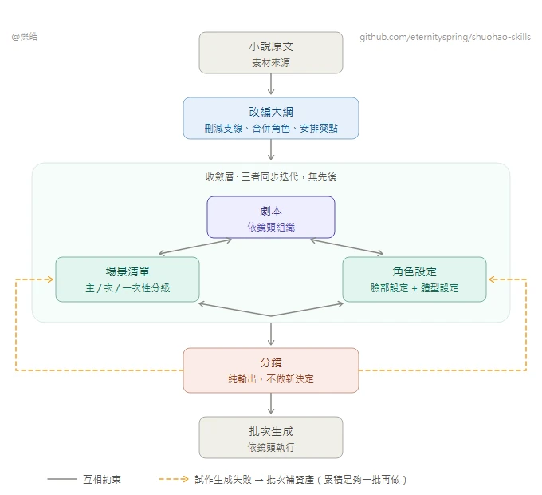

**中文** · [English](README.en.md)

# shuohao-skills

**AI 短劇製作的 skill 集合**：從一本小說到直接餵生成管線的製作素材——拆角色、排大綱、出場景與道具設定、寫劇本、切分鏡。給 AI coding agent 用，**Claude Code 和 codex 都能跑**。

整條管線長這樣——**改編大綱收斂結構，劇本、場景、角色三者同步迭代，分鏡只做輸出不做新決定**：



> **這是 fork。** 上游是 [eternityspring/shuohao-skills](https://github.com/eternityspring/shuohao-skills)，
> 並在原專案基礎上持續整合新功能。本 fork 的差異：
>
> - **預設輸出台灣正體中文**（`zh-TW`），用詞照台灣習慣而不只是換字形。要簡體用 `--lang zh`
> - 新增 **`photoreal`** 畫風預設：擬真實拍，劇組試裝定妝照的質感
>
> 詳見 [CHANGELOG](CHANGELOG.md)。

| Skill | 做什麼 |
| --- | --- |
| [**novel-outline**](skills/novel-outline) | 把一本小說改編成短劇大綱五件套：改編說明、人物表、爽點表、分集梗概、資產清單（含敘事道具表）。14 道品質門全部腳本檢查，支援已有大綱的體檢模式 |
| [**novel-characters**](skills/novel-characters) | 把大綱定下的角色做成角色設定集：人物畫像、形象提示詞、音色提示詞、角色設定圖。吃 outline.json 預填角色表，報告語言與生圖風格可選 |
| [**novel-art**](skills/novel-art) | 給 AI 短劇出美術設定集（場景 + 敘事道具）：一致性錨點、光照與狀態變體、尺度參照、無人無手白底提示詞。吃 outline.json 預填清單，11 道品質門全部腳本檢查 |
| [**novel-script**](skills/novel-script) | 給 AI 短劇寫劇本：場次 + 節拍流（動作與臺詞交替），逐集時長按語速確定性折算，鉤子前 3 拍冷開場兌現是門，臺詞本按角色聚合帶音色提示詞直接對接 TTS。10 道品質門全部腳本檢查 |
| [**novel-storyboard**](skills/novel-storyboard) | 給 AI 短劇出分鏡：段（一次生成 ≤15 秒）→ 分鏡（2–5 秒硬門）→ 分鏡圖（主圖釘 0.00 秒、子圖釘各自切點），MiniMax H3 提示詞的對齊指令與切點時刻逐字對賬；分鏡圖拿設定圖當參考圖真生圖，export 一鍵出投產包。17 道品質門全部腳本檢查 |

**五個 skill 的報告都支援中英雙語介面**：預設中文，`render --lang en` 出全英文報告（資料內容保持原文）。

## 合成一張單頁

五段的報告可以合成一張單頁，左側導航切換——**有哪幾段就出哪幾個面板**：

```bash
node scripts/report.mjs --from <demo目錄> --out report.html
```

`--from` 按下面的[工作目錄約定](#端到端-demo-工作目錄約定)自動發現五份 json；也可以逐個指定（`--outline` `--cast` `--art` `--script` `--storyboard`）。只跑了角色那一段就只有一個面板，不報錯。

它是**組裝器，不是獨立 skill**：不 import 任何 skill 的程式碼，而是調各自的 `render --html` 拿產物再拼裝。所以五個 skill 一行不改、各自仍然獨立可跑、可以單獨拷走；某個 skill 改了渲染，這邊自動跟上。

合併時處理三件事——**這三件都在組裝器裡做，不侵入 skill**：

- **樣式串味**。五份報告共用 57 個類名，其中 13 個同名不同定義（`.copy` `.kpis` `.badge` `.chip`……），所以給每份樣式的每條選擇器加作用域字首
- **腳本串味**。各報告的腳本都是 `document.querySelector('.expo')` 這種全域查詢，合成一頁後只會命中第一個——五個匯出按鈕會全廢。做法是給每份腳本套一層作用域代理
- **圖片路徑**。各報告的圖相對自己那份 json 的目錄（`images/…`、`E01-01/f1.png`），合成後按輸出檔案的位置重算

預設一次顯示一個面板（五份加起來將近六十萬字元）。左下角「平鋪全部」把所有面板同時展開，Cmd+F 恢復全域搜尋。數字鍵 `1`–`5` 切面板，`#pane-script` 這樣的深鏈可以直接分享到某一屏。

```bash
node scripts/report-selftest.mjs   # 92 項斷言，不起瀏覽器
```

丟一本小說進去，出這五套：

**novel-outline · 短劇改編大綱**


**novel-characters · 角色設定集**


**novel-art · 美術設定集（場景 + 道具，設定圖為 skill 實際生成）**


**novel-script · 劇本（時長儀表 + 分集劇本 + 臺詞本）**


**novel-storyboard · 分鏡（分鏡節奏帶 + 主/子分鏡圖為 skill 實際生成 + H3 提示詞）**


## 安裝

```bash
git clone https://github.com/eternityspring/shuohao-skills.git
cd shuohao-skills
./scripts/install.sh
```

自動檢測本機裝了 Claude Code 還是 codex，把所有 skill **軟鏈**過去——`git pull` 之後立刻生效，不用重灌。

```bash
./scripts/install.sh novel-characters   # 只裝某一個
./scripts/install.sh --codex            # 只裝到 codex
./scripts/install.sh --uninstall        # 取消軟鏈
```

不想用腳本就自己鏈：

```bash
ln -s "$PWD/skills/novel-characters" ~/.claude/skills/novel-characters
ln -s "$PWD/skills/novel-characters" ~/.codex/skills/novel-characters
```

## 前置條件

| | 必需？ | 說明 |
| --- | --- | --- |
| **Node** | 必需 | ≥ 18。skill 的腳本只用標準庫，**沒有 npm 依賴，不需要 install** |
| **模型額度** | 必需 | 用你當前會話的額度，**不需要任何 API key** |
| **codex CLI** | 可選 | 生圖才用得上（走內建 `$imagegen`）。沒有就跳過生圖，其餘產出照常 |

## 儲存庫約定

每個 skill 一個目錄，**自包含、可以單獨拷走**：

```
skills/<skill-name>/
├── SKILL.md          給 agent 讀的工作流（必需）
├── README.md         給人讀的說明
├── scripts/
│   ├── <name>.mjs    確定性工具，零依賴
│   └── selftest.mjs  自測，不調模型（必需）
├── references/       按需載入的詳細指令
├── examples/         自帶樣例，同時當測試夾具
└── assets/           截圖
```

兩條硬要求：

- 每個 skill 必須有 `SKILL.md`
- 每個 skill 必須有 `scripts/selftest.mjs`，**不呼叫模型、不花額度**，覆蓋全部確定性邏輯

加新 skill 之前，先把全部自測跑一遍：

```bash
for f in skills/*/scripts/selftest.mjs; do node "$f"; done
```

沒有配 CI——自測足夠快（1 秒），本地跑一次比等 CI 更省事。**只在 macOS + Node 24 上驗過**；程式碼沒有平臺相關呼叫，Linux 和更低版本 Node 理論上沒問題，但沒驗。

## 端到端 demo 工作目錄約定

把一本小說從頭跑完五段（角色 → 大綱 → 美術 → 劇本 → 分鏡），會產出大量 `*.json` / `*.md` / `*-report.html`。**不要平鋪在根目錄**，按五個 skill 各建一個目錄歸檔，一眼對應流水線五段：

```
<demo>/
├── outline/       ← novel-outline 產出：<劇>-outline.json / .md / -report.html
├── characters/    ← novel-characters 產出：<劇>-cast.json / .md / -report.html
├── art/           ← novel-art 產出：<劇>-art.json / .md / -report.html
├── script/        ← novel-script 產出：<劇>-script.json / .md / -report.html
├── storyboard/    ← novel-storyboard 產出：<劇>-storyboard.json / .md / -report.html
│   ├── manifest.json  ← export 產出
│   ├── E01-01/        ← export 的分鏡投產包，每段一個資料夾（prompt.md + f1..fN.png）
│   ├── E01-02/
│   └── …
├── docs/          ← 自己寫的使用說明、PR 草稿等（與機器產物解耦）
└── scripts/       ← 跑管線的輔助腳本（探索期腳本用 _ 字首保留溯源）
```

約定要點：

- **每個 skill 一個目錄**，裝它自己的 `json` / `md` / `html` 三件套，加新角色/場景只往對應目錄放，不汙染根目錄
- **分鏡的 `manifest.json` 與 `E01-0x/` 投產包一起歸 `storyboard/`**，就是 `export --out storyboard` 的原樣產出。**段資料夾不要再往下收一層**（例如收進 `segments/`）：分鏡報告裡的圖走相對路徑 `<段號>/f<切序>.png`，報告 html 與段資料夾必須同級，多套一層目錄，報告裡的圖會**靜默**全變成「未生成」佔位——實測把 10 個段資料夾移進 `segments/` 之後，內嵌圖從 2 張變 0 張，報告不會報錯
- **報告 HTML 與生成的圖/影片可由 `render` 重跑再生**——進版本控制時建議只提交 `json` / `md` / `docs` / `scripts`，報告 HTML 和分鏡 `png` 用 `.gitignore` 排除，保持儲存庫輕量
- 用法類文件（如各報告的使用說明）放 `docs/`，與 skill 自動生成的產物分開，方便單獨維護

> 這套結構來自《渡口》端到端 demo 的實際歸檔經驗，demo 的工作目錄在本儲存庫之外，這裡只固化約定。


## License

[Apache 2.0](LICENSE)
