# 西遊記・主要角色 — 角色表

共 16 位角色：觀音菩薩、鐵扇公主、女兒國國王、白骨夫人、蠍子精、玉兔精、地湧夫人、玉面公主、孫悟空、唐三藏、豬八戒、沙悟淨、如來佛祖、牛魔王、白龍馬、二郎神

## 故事摘要

取經使命把反叛石猴、凡人僧侶、被貶神將與龍族罪人綁成一支不穩定卻持續前行的隊伍。沿途的女性君主、妖王與菩薩不是單一誘惑類型：她們掌握國家、法寶、洞府、毒器、身份與制度權力，也以家族、舊怨、修行與欲望推動不同劫難。本角色群像以八位主要女性和八位核心補充角色呈現師徒關係、神魔秩序與性別權力的交織。

---

## 觀音菩薩（觀世音菩薩、觀世音、南海菩薩）

> 主要角色 · 以慈悲、制度與精準判斷安排取經全局，在師徒無法突破時才介入並把失序力量重新安置。

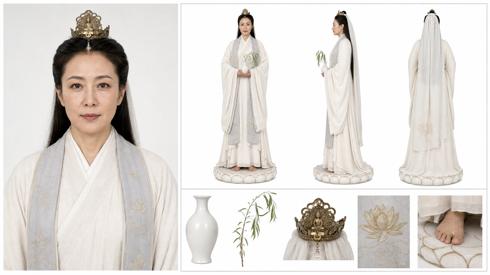

### 人物側寫

- **性別**：女
- **年齡**：外貌約三十五至四十五歲的成年女性形象（推斷）
- **身分**：引導取經工程、在關鍵劫難中提供指引與收伏妖魔的菩薩
- 慈悲 / 沉著 / 具權威 / 善觀察 / 重因果

**外貌**　外貌約四十歲的東亞女性菩薩形象，長橢圓臉、目光安定，姿態端直而不僵硬。穿象牙白交領法衣與淡月灰披帛，低調金線蓮紋，戴素雅寶冠，手持淨瓶與柳枝，赤足立於簡潔蓮座。（推斷）

**性情**　語氣溫和但決斷清楚，能先聽完陳述再指出問題根源；幫助從不等同於取消考驗。

**動機**　使取經人完成西行、讓可教化者各歸其位，並維持天界與人間的因果秩序。

**角色弧線**　她從選定取經人、收束徒眾開始，持續在不同劫難後提供法器、線索或收伏；既是慈悲救援者，也是整個任務的制度設計者。

**人物關係**

- 唐三藏 — 奉旨尋得並引上取經道路的弟子
- 孫悟空 — 賜緊箍並多次指引收伏的護法
- 如來佛祖 — 承命安排東土取經工程的上位者

**原文依據**

> 乃李天王第二太子木叉，今在觀音菩薩寶座前為徒弟護教，法名惠岸是也。」

> 觀音菩薩勸善，願隨他做個徒弟。」禪師大喜道：「好，好，好！」又指定行者

> 袱，你就假謝謝拿來；若不肯，切莫與他爭競，徑至南海菩薩處，將此情告訴，

> 鬥戰勝佛。南無觀世音菩薩。南無大勢至菩薩。南無文殊菩薩。南無普賢菩薩。

### 造型

**畫風**　擬真實拍明代神魔劇試裝定妝照，象牙白、月灰與低彩金色

`live-action`, `photographic`, `wardrobe camera test`, `character sheet`, `real skin texture`, `85mm lens`

**生圖提示詞 EN**

```text
Live-action photography, not illustration: a real wardrobe camera-test photograph of a real human being on a film production, shot on a full-frame cinema camera with a 50-85mm lens at a moderate aperture against a neutral warm-gray seamless studio backdrop, the finish and honesty of a costume-department test still. an adult East Asian woman embodying a Buddhist bodhisattva in a Ming-dynasty Chinese supernatural drama, apparent age around forty, long oval face, calm observant eyes and upright compassionate authority She wears layered ivory-white crossed Buddhist robes, a pale moon-gray stole with restrained gold lotus embroidery, a practical understated crown, and carries a white ritual vase with a willow sprig; bare feet on a simple lotus platform. Three-quarter waist-up portrait, identity in sharpest focus, soft-box key from upper left and gentle cool fill. True photographic skin: real visible pores, fine vellus hair, uneven natural tone, faint capillaries at the nostrils and ear rims, genuine subsurface scattering, moles and freckles left in place, no beauty retouching and no skin smoothing; eyes with a real catchlight from the key light, moist lower lid, resolvable iris fibres and a limbal ring; eyebrows and eyelids honestly asymmetric; loose individual hair strands catching the light and breaking the silhouette. Real garments with true cloth weight, visible weave, stitched seams and hems, natural drape, self-shadowing folds and honest wear at cuffs, elbows and knees. No illustration, CGI, text or watermark.
```

擬真實拍明代神魔劇試裝定妝照：外貌約四十歲的東亞女性菩薩形象，長橢圓臉、目光安定，姿態端直而不僵硬。穿象牙白交領法衣與淡月灰披帛，低調金線蓮紋，戴素雅寶冠，手持淨瓶與柳枝，赤足立於簡潔蓮座。暖灰棚拍背景，左上柔光箱主光，保留自然材質、磨損與實拍細節。

**負向提示詞**

```text
illustration, painting, drawing, sketch, anime, manga, cartoon, cel shading, digital painting brush strokes, CGI, 3d game render, plastic or waxy skin, doll skin, beauty-filter retouching, poreless airbrushed complexion, perfectly symmetrical face, dead flat eyes without a catchlight, wig-like helmet hair with no loose strands, flat untextured costume fabric, cheap cosplay-shop garment, stiff mannequin posing, modern clothing, Qing dynasty queue, generic western fantasy, extra fingers, malformed hands, text, watermark, signature, busy or patterned background, harsh cast shadows on the backdrop, male actor, beard, erotic goddess, exposed body, oversized halo, Indian cinema costume, gaudy gold fantasy armour
```

**角色設定圖提示詞 EN**

```text
Use case: historical-scene. Asset type: live-action production character model sheet. Create ONE 16:9 landscape canvas. CHARACTER: an adult East Asian woman embodying a Buddhist bodhisattva in a Ming-dynasty Chinese supernatural drama, apparent age around forty, long oval face, calm observant eyes and upright compassionate authority She wears layered ivory-white crossed Buddhist robes, a pale moon-gray stole with restrained gold lotus embroidery, a practical understated crown, and carries a white ritual vase with a willow sprig; bare feet on a simple lotus platform. Divide the canvas into three zones with thin hairline rules. LEFT ZONE, about 34% of the width: one large front-facing head-and-shoulders bust, centred like an ID photograph, both shoulders fully visible with clear side margins, clean straight horizontal bottom cut. This is the facial identity anchor. LIGHTING IN THE LEFT ZONE ONLY: a large soft-box key from the upper left with gentle bounce fill and real ambient occlusion under chin, in eye sockets and at the collar. RIGHT-TOP ZONE: exactly three equal-height FULL-BODY views of the SAME actor or creature performer, true front, strict 90-degree left profile and true back, on a shared ground line. They must match the bust exactly in face, age, body, hair, prosthetics, garments, colours and footwear. PROPORTIONS ARE CRITICAL: correct anatomy and limb lengths, clear margins above head and below feet, no stretching, squashing or foreshortening. LIGHTING IN THE RIGHT ZONES: flat even frontal studio light, no directional key and no cast shadows on the backdrop. RIGHT-BOTTOM ZONE: four to five small isolated detail studies: white ritual vase, willow sprig, restrained crown, gold lotus embroidery, bare foot and simple lotus edge. Details are smaller than figures; if space is tight extend them down the right edge; the detail studies give way, not the figures. Plain pure white background, generous even margins, no scenery, no written labels, no text, no watermark, no extra people. Live-action photography, not illustration: a real wardrobe camera-test photograph of a real human being on a film production, shot on a full-frame cinema camera with a 50-85mm lens at a moderate aperture against a neutral warm-gray seamless studio backdrop, the finish and honesty of a costume-department test still. True photographic skin: real visible pores, fine vellus hair, uneven natural tone, faint capillaries at the nostrils and ear rims, genuine subsurface scattering, moles and freckles left in place, no beauty retouching and no skin smoothing; eyes with a real catchlight from the key light, moist lower lid, resolvable iris fibres and a limbal ring; eyebrows and eyelids honestly asymmetric; loose individual hair strands catching the light and breaking the silhouette. Real garments with true cloth weight, visible weave, stitched seams and hems, natural drape, self-shadowing folds and honest wear at cuffs, elbows and knees.
```

### 聲音

- **音色**：清澈穩定的成年女中音
- **音高**：中音
- **語速**：從容，判斷處有短停頓
- **口音**：清晰端正的中原官話語感（推斷）
- **情緒**：慈和而不失權威
- **類比**：像一位能以最少話語讓混亂眾人各自歸位的導師

**配音提示詞 EN**

```text
A mature female mezzo voice, mid pitch, clear stable resonance, formal central-Chinese diction, unhurried pacing with brief pauses before judgments, compassionate authority without sentimentality.
```

約四十歲的清澈女中音，音高居中、共鳴穩定；咬字端正，語速從容，判斷前短停頓，慈和而具權威。

---

## 鐵扇公主（羅剎女、鐵扇仙）

> 主要角色 · 以芭蕉扇與領地權威守住自身家門，對兒子被收伏的怨恨使她拒絕取經團隊的請求。

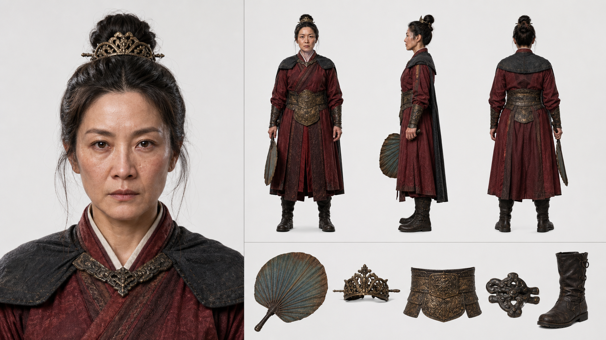

### 人物側寫

- **性別**：女
- **年齡**：約三十五至四十五歲的成年女性形象（推斷）
- **身分**：芭蕉洞主人、牛魔王之妻、紅孩兒之母，掌芭蕉扇控制火焰山風勢
- 剛烈 / 護子 / 自尊 / 善戰 / 記仇

**外貌**　約四十歲的東亞女性洞府主人，方橢圓臉、顴骨明確、目光強硬，體格結實而成熟。穿暗朱紅交領戰袍、炭黑披肩與暗金護腰，梳高髻配銅冠，手持可實際開闔的大型青褐芭蕉扇，穿黑褐戰靴。（推斷）

**性情**　談判時冷硬防備，觸及兒子與丈夫便迅速爆發；敗勢中仍能審時度勢換取家人安全。

**動機**　保住芭蕉洞、法寶與家族尊嚴，向她認定傷害紅孩兒的人討回代價。

**角色弧線**　她從拒借芭蕉扇、以假扇反制，到在夫妻與取經團隊的大戰中失勢，最後交出真扇並接受新的家族結局。

**人物關係**

- 牛魔王 — 感情破裂但仍共同捲入戰局的丈夫
- 紅孩兒 — 她強烈保護、也因其被收伏而結怨的兒子
- 孫悟空 — 為借扇多次變化交鋒的對手

**原文依據**

> 的兒子，羅剎女養的。他曾在火燄山修行了三百年，煉成三昧真火，卻也神通廣

> 喚名羅剎女，又叫做鐵扇公主。他的那芭蕉扇本是崑崙山後，自混沌開闢以

> 做牛魔王，去哄那羅剎女，騙他扇子，送我師父過山為妙。」

> 就口中吐出扇子，遞與羅剎女。羅剎女接扇在手，滿眼垂淚道：「大王，把

### 造型

**畫風**　擬真實拍明代神魔劇試裝定妝照，暗朱紅、炭黑、暗金與青褐

`live-action`, `photographic`, `wardrobe camera test`, `character sheet`, `real skin texture`, `85mm lens`

**生圖提示詞 EN**

```text
Live-action photography, not illustration: a real wardrobe camera-test photograph of a real human being on a film production, shot on a full-frame cinema camera with a 50-85mm lens at a moderate aperture against a neutral warm-gray seamless studio backdrop, the finish and honesty of a costume-department test still. a forty-year-old East Asian woman, sovereign cave-dweller and battle-tested mother in a Ming-dynasty Chinese supernatural drama, defined cheekbones, square-oval face, hard direct eyes and mature strong build She wears a dark-vermilion crossed battle robe, charcoal shoulder mantle, muted-gold waist protection, high bun with a bronze crown, black-brown battle boots and carries a large practical folding banana-leaf fan in weathered teal-brown. Three-quarter waist-up portrait, identity in sharpest focus, soft-box key from upper left and gentle cool fill. True photographic skin: real visible pores, fine vellus hair, uneven natural tone, faint capillaries at the nostrils and ear rims, genuine subsurface scattering, moles and freckles left in place, no beauty retouching and no skin smoothing; eyes with a real catchlight from the key light, moist lower lid, resolvable iris fibres and a limbal ring; eyebrows and eyelids honestly asymmetric; loose individual hair strands catching the light and breaking the silhouette. Real garments with true cloth weight, visible weave, stitched seams and hems, natural drape, self-shadowing folds and honest wear at cuffs, elbows and knees. No illustration, CGI, text or watermark.
```

擬真實拍明代神魔劇試裝定妝照：約四十歲的東亞女性洞府主人，方橢圓臉、顴骨明確、目光強硬，體格結實而成熟。穿暗朱紅交領戰袍、炭黑披肩與暗金護腰，梳高髻配銅冠，手持可實際開闔的大型青褐芭蕉扇，穿黑褐戰靴。暖灰棚拍背景，左上柔光箱主光，保留自然材質、磨損與實拍細節。

**負向提示詞**

```text
illustration, painting, drawing, sketch, anime, manga, cartoon, cel shading, digital painting brush strokes, CGI, 3d game render, plastic or waxy skin, doll skin, beauty-filter retouching, poreless airbrushed complexion, perfectly symmetrical face, dead flat eyes without a catchlight, wig-like helmet hair with no loose strands, flat untextured costume fabric, cheap cosplay-shop garment, stiff mannequin posing, modern clothing, Qing dynasty queue, generic western fantasy, extra fingers, malformed hands, text, watermark, signature, busy or patterned background, harsh cast shadows on the backdrop, young glamour model, exposed midriff, belly-dancer costume, generic witch, decorative hand fan too small to use
```

**角色設定圖提示詞 EN**

```text
Use case: historical-scene. Asset type: live-action production character model sheet. Create ONE 16:9 landscape canvas. CHARACTER: a forty-year-old East Asian woman, sovereign cave-dweller and battle-tested mother in a Ming-dynasty Chinese supernatural drama, defined cheekbones, square-oval face, hard direct eyes and mature strong build She wears a dark-vermilion crossed battle robe, charcoal shoulder mantle, muted-gold waist protection, high bun with a bronze crown, black-brown battle boots and carries a large practical folding banana-leaf fan in weathered teal-brown. Divide the canvas into three zones with thin hairline rules. LEFT ZONE, about 34% of the width: one large front-facing head-and-shoulders bust, centred like an ID photograph, both shoulders fully visible with clear side margins, clean straight horizontal bottom cut. This is the facial identity anchor. LIGHTING IN THE LEFT ZONE ONLY: a large soft-box key from the upper left with gentle bounce fill and real ambient occlusion under chin, in eye sockets and at the collar. RIGHT-TOP ZONE: exactly three equal-height FULL-BODY views of the SAME actor or creature performer, true front, strict 90-degree left profile and true back, on a shared ground line. They must match the bust exactly in face, age, body, hair, prosthetics, garments, colours and footwear. PROPORTIONS ARE CRITICAL: correct anatomy and limb lengths, clear margins above head and below feet, no stretching, squashing or foreshortening. LIGHTING IN THE RIGHT ZONES: flat even frontal studio light, no directional key and no cast shadows on the backdrop. RIGHT-BOTTOM ZONE: four to five small isolated detail studies: large folding banana-leaf fan, bronze hair crown, muted-gold waist guard, dark mantle clasp, black-brown battle boot. Details are smaller than figures; if space is tight extend them down the right edge; the detail studies give way, not the figures. Plain pure white background, generous even margins, no scenery, no written labels, no text, no watermark, no extra people. Live-action photography, not illustration: a real wardrobe camera-test photograph of a real human being on a film production, shot on a full-frame cinema camera with a 50-85mm lens at a moderate aperture against a neutral warm-gray seamless studio backdrop, the finish and honesty of a costume-department test still. True photographic skin: real visible pores, fine vellus hair, uneven natural tone, faint capillaries at the nostrils and ear rims, genuine subsurface scattering, moles and freckles left in place, no beauty retouching and no skin smoothing; eyes with a real catchlight from the key light, moist lower lid, resolvable iris fibres and a limbal ring; eyebrows and eyelids honestly asymmetric; loose individual hair strands catching the light and breaking the silhouette. Real garments with true cloth weight, visible weave, stitched seams and hems, natural drape, self-shadowing folds and honest wear at cuffs, elbows and knees.
```

### 聲音

- **音色**：成熟強韌的女低音
- **音高**：中低音
- **語速**：冷慢開場，動怒時短促有力
- **口音**：西域洞府口音混中原語感（推斷）
- **情緒**：怨憤、自尊、護子
- **類比**：像一位先把條件說死、再用一記扇風結束談判的領主

**配音提示詞 EN**

```text
A mature female contralto, low-mid pitch, strong dry resonance, measured hostile openings that sharpen into clipped force, proud maternal anger and territorial authority.
```

約四十歲的成熟女低音，聲線強韌偏乾；開場冷慢，動怒時縮成短促重句，帶護子怨憤與領地主權感。

---

## 女兒國國王（西梁女王、女王）

> 主要角色 · 以一國之主的真誠與政治資源邀請唐三藏留下，使取經使命第一次受到並非暴力的情感考驗。

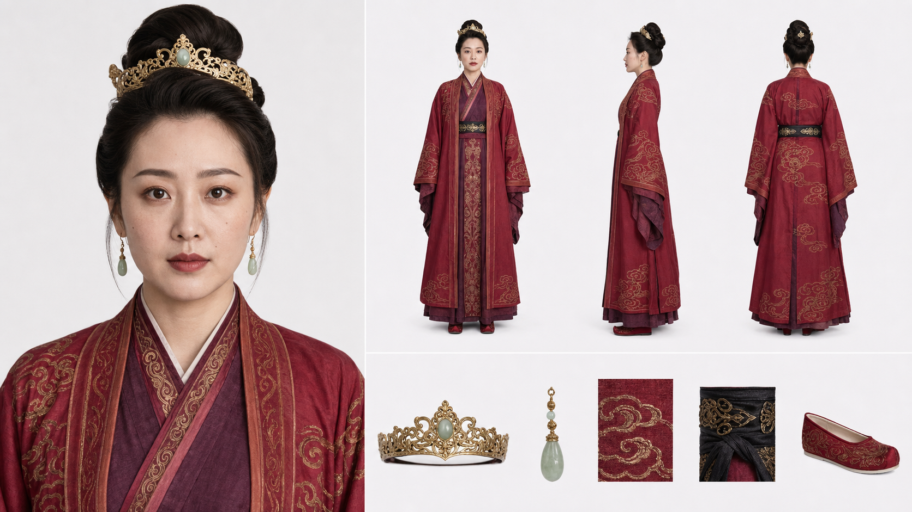

### 人物側寫

- **性別**：女
- **年齡**：約二十八至三十五歲的成年女性形象（推斷）
- **身分**：西梁女國的統治者，向唐三藏提出婚姻與讓位邀請
- 真誠 / 端莊 / 有決斷力 / 重感情 / 具政治感

**外貌**　約三十二歲的東亞女性君主，端正長圓臉、目光聰慧溫定，坐立帶成熟的朝堂控制力。穿深緋與紫檀色交領王袍，織低調金線雲紋，戴窄幅金冠與玉耳墜，束黑金腰帶，穿深紅履。（推斷）

**性情**　在朝堂上明快有禮，私下情感直接卻仍維持君主分寸；被拒後哀傷而不失國體。

**動機**　取得能共同治理國家的伴侶，兼顧個人情感、王位延續與國家穩定。

**角色弧線**　她從國書接待轉為主動提親，願讓出王位與唐三藏共享國家；最終接受對方離去，留下情感與使命無法兼得的餘韻。

**人物關係**

- 唐三藏 — 她真誠求婚、希望留下共治的對象
- 孫悟空 — 以權宜話術協助師父脫身的護法
- 女太師 — 代為議婚與處理朝政的重臣

**原文依據**

> 西梁女國。這起人都是做買賣的。我這邊百錢之物，到那邊可值萬錢﹔那邊百錢

> 旌旗映御階。此地自來無合巹，女王今日配男才。

> 僧解開包袱，取出關文。大聖將關文雙手捧上。那女王細看一番，上有大唐皇帝

> 有寶象國印、烏雞國印、車遲國印、西梁女國印、祭賽國印、朱紫國印、比丘國

### 造型

**畫風**　擬真實拍明代神魔劇試裝定妝照，深緋、紫檀、黑金與玉白

`live-action`, `photographic`, `wardrobe camera test`, `character sheet`, `real skin texture`, `85mm lens`

**生圖提示詞 EN**

```text
Live-action photography, not illustration: a real wardrobe camera-test photograph of a real human being on a film production, shot on a full-frame cinema camera with a 50-85mm lens at a moderate aperture against a neutral warm-gray seamless studio backdrop, the finish and honesty of a costume-department test still. a thirty-two-year-old East Asian woman ruling the Western Liang women’s kingdom in a Ming-dynasty Chinese supernatural drama, dignified long-round face, intelligent warm eyes and mature courtly command She wears layered deep-crimson and rosewood-purple crossed royal robes with restrained gold cloud weaving, a narrow gold crown, jade drop earrings, black-gold sash and deep-red court shoes. Three-quarter waist-up portrait, identity in sharpest focus, soft-box key from upper left and gentle cool fill. True photographic skin: real visible pores, fine vellus hair, uneven natural tone, faint capillaries at the nostrils and ear rims, genuine subsurface scattering, moles and freckles left in place, no beauty retouching and no skin smoothing; eyes with a real catchlight from the key light, moist lower lid, resolvable iris fibres and a limbal ring; eyebrows and eyelids honestly asymmetric; loose individual hair strands catching the light and breaking the silhouette. Real garments with true cloth weight, visible weave, stitched seams and hems, natural drape, self-shadowing folds and honest wear at cuffs, elbows and knees. No illustration, CGI, text or watermark.
```

擬真實拍明代神魔劇試裝定妝照：約三十二歲的東亞女性君主，端正長圓臉、目光聰慧溫定，坐立帶成熟的朝堂控制力。穿深緋與紫檀色交領王袍，織低調金線雲紋，戴窄幅金冠與玉耳墜，束黑金腰帶，穿深紅履。暖灰棚拍背景，左上柔光箱主光，保留自然材質、磨損與實拍細節。

**負向提示詞**

```text
illustration, painting, drawing, sketch, anime, manga, cartoon, cel shading, digital painting brush strokes, CGI, 3d game render, plastic or waxy skin, doll skin, beauty-filter retouching, poreless airbrushed complexion, perfectly symmetrical face, dead flat eyes without a catchlight, wig-like helmet hair with no loose strands, flat untextured costume fabric, cheap cosplay-shop garment, stiff mannequin posing, modern clothing, Qing dynasty queue, generic western fantasy, extra fingers, malformed hands, text, watermark, signature, busy or patterned background, harsh cast shadows on the backdrop, teen princess, bridal veil, exposed cleavage, western crown, submissive decorative consort, oversized imperial dragon motifs
```

**角色設定圖提示詞 EN**

```text
Use case: historical-scene. Asset type: live-action production character model sheet. Create ONE 16:9 landscape canvas. CHARACTER: a thirty-two-year-old East Asian woman ruling the Western Liang women’s kingdom in a Ming-dynasty Chinese supernatural drama, dignified long-round face, intelligent warm eyes and mature courtly command She wears layered deep-crimson and rosewood-purple crossed royal robes with restrained gold cloud weaving, a narrow gold crown, jade drop earrings, black-gold sash and deep-red court shoes. Divide the canvas into three zones with thin hairline rules. LEFT ZONE, about 34% of the width: one large front-facing head-and-shoulders bust, centred like an ID photograph, both shoulders fully visible with clear side margins, clean straight horizontal bottom cut. This is the facial identity anchor. LIGHTING IN THE LEFT ZONE ONLY: a large soft-box key from the upper left with gentle bounce fill and real ambient occlusion under chin, in eye sockets and at the collar. RIGHT-TOP ZONE: exactly three equal-height FULL-BODY views of the SAME actor or creature performer, true front, strict 90-degree left profile and true back, on a shared ground line. They must match the bust exactly in face, age, body, hair, prosthetics, garments, colours and footwear. PROPORTIONS ARE CRITICAL: correct anatomy and limb lengths, clear margins above head and below feet, no stretching, squashing or foreshortening. LIGHTING IN THE RIGHT ZONES: flat even frontal studio light, no directional key and no cast shadows on the backdrop. RIGHT-BOTTOM ZONE: four to five small isolated detail studies: narrow gold crown, jade drop earring, restrained cloud weave, black-gold sash, deep-red court shoe. Details are smaller than figures; if space is tight extend them down the right edge; the detail studies give way, not the figures. Plain pure white background, generous even margins, no scenery, no written labels, no text, no watermark, no extra people. Live-action photography, not illustration: a real wardrobe camera-test photograph of a real human being on a film production, shot on a full-frame cinema camera with a 50-85mm lens at a moderate aperture against a neutral warm-gray seamless studio backdrop, the finish and honesty of a costume-department test still. True photographic skin: real visible pores, fine vellus hair, uneven natural tone, faint capillaries at the nostrils and ear rims, genuine subsurface scattering, moles and freckles left in place, no beauty retouching and no skin smoothing; eyes with a real catchlight from the key light, moist lower lid, resolvable iris fibres and a limbal ring; eyebrows and eyelids honestly asymmetric; loose individual hair strands catching the light and breaking the silhouette. Real garments with true cloth weight, visible weave, stitched seams and hems, natural drape, self-shadowing folds and honest wear at cuffs, elbows and knees.
```

### 聲音

- **音色**：溫潤清晰的成年女中音
- **音高**：中音
- **語速**：朝堂從容，私語略放慢
- **口音**：西梁宮廷官話語感（推斷）
- **情緒**：自信、真誠、離別時克制
- **類比**：像一位把求婚也說成完整國策、卻不掩真心的女王

**配音提示詞 EN**

```text
An adult female mezzo voice, mid pitch, warm lucid resonance, formal court diction, composed public cadence that softens in private, confident sincerity with restrained grief at farewell.
```

約三十二歲的溫潤女中音，音高居中、咬字清晰；朝堂語速從容，私下稍慢，兼有君主自信與真誠情感。

---

## 白骨夫人（白骨精、白骨妖）

> 主要角色 · 擅長利用人類親屬形象與師徒信任裂縫接近獵物，本相的死亡感始終從偽裝下滲出。

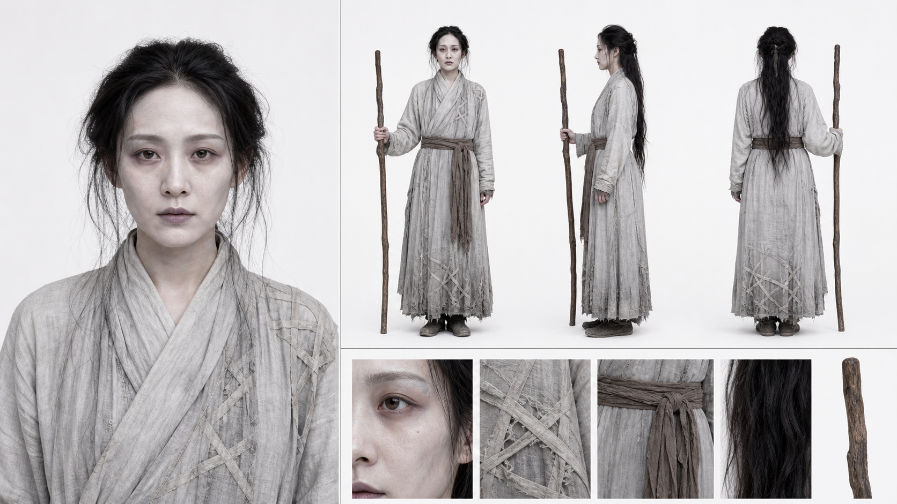

### 人物側寫

- **性別**：女
- **年齡**：固定本相不適用人類年齡；人形外觀約三十五歲（推斷）
- **身分**：白虎嶺以白骨成精、三次變化試圖捕食唐三藏的妖魔
- 狡猾 / 耐心 / 擅偽裝 / 狠辣 / 善讀人心

**外貌**　固定為成年東亞女性形態的古老亡靈，完整無傷的皮膚覆灰白舞台妝，以柔和陰影勾出清楚骨相，眼窩深而有冷光，仍保留可辨識的同一張臉。穿褪灰白交領長袍與枯褐腰帶，衣料織有低調骨節抽象紋，髮絲灰黑鬆散，持一支枯木手杖；全身無傷口、無外露骨頭。（推斷）

**性情**　表面柔弱可信，失敗後迅速改換身分與話術；本相冷靜少怒，把他人同情視為工具。

**動機**　吞食唐僧以取得長生，同時證明自己能利用善心與懷疑突破最強護衛。

**角色弧線**　她先後化作少女、老婦、老翁試探師徒，三次被悟空識破；最終本相被打死，卻也成功使唐僧與悟空決裂一段時間。

**人物關係**

- 孫悟空 — 三次識破變化並擊殺她的對手
- 唐三藏 — 她企圖捕食並利用其慈悲接近的目標
- 豬八戒 — 誤導師父、放大對悟空懷疑的人

**原文依據**

> 字，叫做『白骨夫人』。」唐僧聞說，倒也信了。怎禁那八戒傍邊唆嘴道：

> 嶺上，打殺了那白骨夫人，他怪我攛掇師父念緊箍兒咒。我也只當耍子，不想那

### 造型

**畫風**　擬真實拍明代神魔劇試裝定妝照，灰白、枯褐、冷黑與粉灰

`live-action`, `photographic`, `wardrobe camera test`, `character sheet`, `real skin texture`, `85mm lens`, `practical ghost makeup`

**生圖提示詞 EN**

```text
Live-action photography, not illustration: a real wardrobe camera-test photograph of a real human being on a film production, shot on a full-frame cinema camera with a 50-85mm lens at a moderate aperture against a neutral warm-gray seamless studio backdrop, the finish and honesty of a costume-department test still. a fixed adult female ancient ghost form in a Ming-dynasty Chinese supernatural drama, East Asian facial structure under intact chalk-pale theatrical makeup, soft gray contouring that suggests a stark bone structure without wounds, deep cold eyes and the same identity in every view She wears faded ash-white crossed robes, a dry-brown sash, loose gray-black hair and subtle abstract joint-like weaving in the cloth, carrying a plain deadwood staff; intact body, no injury and no exposed bones. Three-quarter waist-up portrait, identity in sharpest focus, soft-box key from upper left and gentle cool fill. True photographic skin: real visible pores, fine vellus hair, uneven natural tone, faint capillaries at the nostrils and ear rims, genuine subsurface scattering, moles and freckles left in place, no beauty retouching and no skin smoothing; eyes with a real catchlight from the key light, moist lower lid, resolvable iris fibres and a limbal ring; eyebrows and eyelids honestly asymmetric; loose individual hair strands catching the light and breaking the silhouette. Real garments with true cloth weight, visible weave, stitched seams and hems, natural drape, self-shadowing folds and honest wear at cuffs, elbows and knees. No illustration, CGI, text or watermark.
```

擬真實拍明代神魔劇試裝定妝照：固定為成年東亞女性形態的古老亡靈，完整無傷的皮膚覆灰白舞台妝，以柔和陰影勾出清楚骨相，眼窩深而有冷光，仍保留可辨識的同一張臉。穿褪灰白交領長袍與枯褐腰帶，衣料織有低調骨節抽象紋，髮絲灰黑鬆散，持一支枯木手杖；全身無傷口、無外露骨頭。暖灰棚拍背景，左上柔光箱主光，保留自然材質、磨損與實拍細節。

**負向提示詞**

```text
illustration, painting, drawing, sketch, anime, manga, cartoon, cel shading, digital painting brush strokes, CGI, 3d game render, plastic or waxy skin, doll skin, beauty-filter retouching, poreless airbrushed complexion, perfectly symmetrical face, dead flat eyes without a catchlight, wig-like helmet hair with no loose strands, flat untextured costume fabric, cheap cosplay-shop garment, stiff mannequin posing, modern clothing, Qing dynasty queue, generic western fantasy, extra fingers, malformed hands, text, watermark, signature, busy or patterned background, harsh cast shadows on the backdrop, glamour beauty retouching, three disguise victims, extra people, injury, wound, exposed bone, skeleton, gore, blood, horror corpse, changing faces between views
```

**角色設定圖提示詞 EN**

```text
Use case: historical-scene. Asset type: live-action production character model sheet. Create ONE 16:9 landscape canvas. CHARACTER: a fixed adult female ancient ghost form in a Ming-dynasty Chinese supernatural drama, East Asian facial structure under intact chalk-pale theatrical makeup, soft gray contouring that suggests a stark bone structure without wounds, deep cold eyes and the same identity in every view She wears faded ash-white crossed robes, a dry-brown sash, loose gray-black hair and subtle abstract joint-like weaving in the cloth, carrying a plain deadwood staff; intact body, no injury and no exposed bones. Divide the canvas into three zones with thin hairline rules. LEFT ZONE, about 34% of the width: one large front-facing head-and-shoulders bust, centred like an ID photograph, both shoulders fully visible with clear side margins, clean straight horizontal bottom cut. This is the facial identity anchor. LIGHTING IN THE LEFT ZONE ONLY: a large soft-box key from the upper left with gentle bounce fill and real ambient occlusion under chin, in eye sockets and at the collar. RIGHT-TOP ZONE: exactly three equal-height FULL-BODY views of the SAME actor or creature performer, true front, strict 90-degree left profile and true back, on a shared ground line. They must match the bust exactly in face, age, body, hair, prosthetics, garments, colours and footwear. PROPORTIONS ARE CRITICAL: correct anatomy and limb lengths, clear margins above head and below feet, no stretching, squashing or foreshortening. LIGHTING IN THE RIGHT ZONES: flat even frontal studio light, no directional key and no cast shadows on the backdrop. RIGHT-BOTTOM ZONE: four to five small isolated detail studies: intact chalk-pale theatrical cheek makeup, subtle joint-like cloth weave, dry-brown sash, gray-black hair strand, plain deadwood staff. Details are smaller than figures; if space is tight extend them down the right edge; the detail studies give way, not the figures. Plain pure white background, generous even margins, no scenery, no written labels, no text, no watermark, no extra people. Live-action photography, not illustration: a real wardrobe camera-test photograph of a real human being on a film production, shot on a full-frame cinema camera with a 50-85mm lens at a moderate aperture against a neutral warm-gray seamless studio backdrop, the finish and honesty of a costume-department test still. True photographic skin: real visible pores, fine vellus hair, uneven natural tone, faint capillaries at the nostrils and ear rims, genuine subsurface scattering, moles and freckles left in place, no beauty retouching and no skin smoothing; eyes with a real catchlight from the key light, moist lower lid, resolvable iris fibres and a limbal ring; eyebrows and eyelids honestly asymmetric; loose individual hair strands catching the light and breaking the silhouette. Real garments with true cloth weight, visible weave, stitched seams and hems, natural drape, self-shadowing folds and honest wear at cuffs, elbows and knees.
```

### 聲音

- **音色**：乾冷帶空腔感的成年女中低音
- **音高**：中低音
- **語速**：偽裝時柔慢，本相精準冷淡
- **口音**：山野口音可隨偽裝切換（推斷）
- **情緒**：算計、飢餓、缺乏同理
- **類比**：像一個能把慈愛語氣當成捕獵工具的古老獵手

**配音提示詞 EN**

```text
A mature female low mezzo voice, dry hollow resonance, softly imitative cadence in disguise and precise cold timing in true form, calculating hunger without theatrical shrieking.
```

成年女中低音，聲線乾冷帶空腔感；偽裝時柔慢可信，本相則咬字精準冷淡，沒有誇張尖叫。

---

## 蠍子精（蝎子精、琵琶洞女怪、毒敵山女妖）

> 主要角色 · 以強大毒鉤、近戰能力與直接求偶欲望綁住唐三藏，是少數能正面壓制悟空與八戒的女妖。

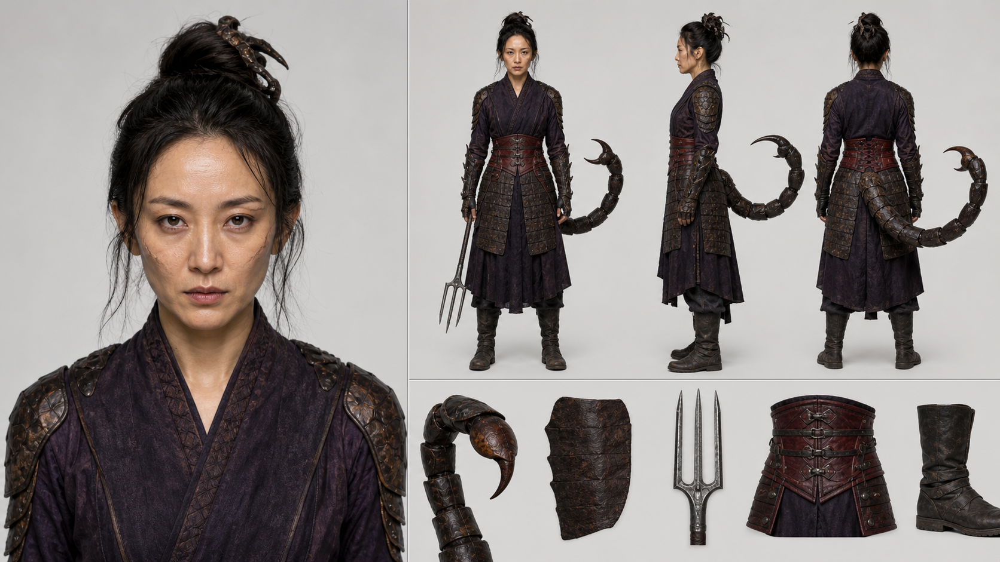

### 人物側寫

- **性別**：女
- **年齡**：固定妖身外觀約三十至四十歲（推斷）
- **身分**：毒敵山琵琶洞的母蠍妖，以倒馬毒樁傷過如來與孫悟空
- 強悍 / 自信 / 具侵略性 / 好勝 / 執著

**外貌**　約三十五歲的東亞女性蠍妖固定人形，窄長臉、目光銳利，身形強健，後腰連接一條可動實體蠍尾，前臂有低調黑褐甲殼。穿深紫黑窄袖戰袍、暗紅護腰與分片裙甲，持三股鋼叉，黑褐甲殼尾鉤從背後完整可見，穿硬皮戰靴。（推斷）

**性情**　對唐三藏刻意柔媚，對戰時毫不拖延；遭拒與被攻洞後立刻轉為壓迫性武力。

**動機**　強迫唐三藏成為伴侶並守住洞府，以自身修為與毒器壓倒反對者。

**角色弧線**　她擄走唐三藏並試圖成婚，能以鋼叉與毒鉤抗衡悟空、八戒；最後在昴日星官克制下現出蠍子本相而亡。

**人物關係**

- 唐三藏 — 她試圖強迫結合、但始終拒絕的對象
- 孫悟空 — 被倒馬毒刺傷並求援的主要對手
- 昴日星官 — 以天敵之聲逼她現形死亡者

**原文依據**

> 有六個大字，乃是「毒敵山琵琶洞」。八戒無知，上前就使釘鈀築門。行者急止

> 股叉是生成的兩隻鉗腳。扎人痛者，是尾上一個鉤子，喚做倒馬毒。本身是個蝎

> 聲。那怪即時就現了本相，原來是個琵琶來大小的一個蝎子精。這星官再叫一

> 話說唐三藏咬釘嚼鐵，以死命留得一個不壞之身，感蒙行者等打死蝎子精，救出

### 造型

**畫風**　擬真實拍明代神魔劇試裝定妝照，深紫黑、暗紅、黑褐甲殼與冷鋼

`live-action`, `photographic`, `wardrobe camera test`, `character sheet`, `real skin texture`, `85mm lens`, `practical creature prosthetics`

**生圖提示詞 EN**

```text
Live-action photography, not illustration: a real wardrobe camera-test photograph of a real human being on a film production, shot on a full-frame cinema camera with a 50-85mm lens at a moderate aperture against a neutral warm-gray seamless studio backdrop, the finish and honesty of a costume-department test still. a thirty-five-year-old East Asian woman in a fixed practical scorpion-demon form for a Ming-dynasty Chinese supernatural drama, narrow long face, piercing eyes, strong athletic body, articulated dark-brown chitin forearm plates and one physically connected scorpion tail with a hooked stinger She wears a deep purple-black narrow-sleeved battle robe, dark-red waist protection, segmented skirt armour, hard leather boots and carries a three-pronged steel fork; the practical tail remains fully visible behind her. Three-quarter waist-up portrait, identity in sharpest focus, soft-box key from upper left and gentle cool fill. True photographic skin: real visible pores, fine vellus hair, uneven natural tone, faint capillaries at the nostrils and ear rims, genuine subsurface scattering, moles and freckles left in place, no beauty retouching and no skin smoothing; eyes with a real catchlight from the key light, moist lower lid, resolvable iris fibres and a limbal ring; eyebrows and eyelids honestly asymmetric; loose individual hair strands catching the light and breaking the silhouette. Real garments with true cloth weight, visible weave, stitched seams and hems, natural drape, self-shadowing folds and honest wear at cuffs, elbows and knees. No illustration, CGI, text or watermark.
```

擬真實拍明代神魔劇試裝定妝照：約三十五歲的東亞女性蠍妖固定人形，窄長臉、目光銳利，身形強健，後腰連接一條可動實體蠍尾，前臂有低調黑褐甲殼。穿深紫黑窄袖戰袍、暗紅護腰與分片裙甲，持三股鋼叉，黑褐甲殼尾鉤從背後完整可見，穿硬皮戰靴。暖灰棚拍背景，左上柔光箱主光，保留自然材質、磨損與實拍細節。

**負向提示詞**

```text
illustration, painting, drawing, sketch, anime, manga, cartoon, cel shading, digital painting brush strokes, CGI, 3d game render, plastic or waxy skin, doll skin, beauty-filter retouching, poreless airbrushed complexion, perfectly symmetrical face, dead flat eyes without a catchlight, wig-like helmet hair with no loose strands, flat untextured costume fabric, cheap cosplay-shop garment, stiff mannequin posing, modern clothing, Qing dynasty queue, generic western fantasy, extra fingers, malformed hands, text, watermark, signature, busy or patterned background, harsh cast shadows on the backdrop, male actor, beard, exposed fetish armour, multiple tails, detached tail, insect-centaur body, graphic gore, glamorous seduction pose
```

**角色設定圖提示詞 EN**

```text
Use case: historical-scene. Asset type: live-action production character model sheet. Create ONE 16:9 landscape canvas. CHARACTER: a thirty-five-year-old East Asian woman in a fixed practical scorpion-demon form for a Ming-dynasty Chinese supernatural drama, narrow long face, piercing eyes, strong athletic body, articulated dark-brown chitin forearm plates and one physically connected scorpion tail with a hooked stinger She wears a deep purple-black narrow-sleeved battle robe, dark-red waist protection, segmented skirt armour, hard leather boots and carries a three-pronged steel fork; the practical tail remains fully visible behind her. Divide the canvas into three zones with thin hairline rules. LEFT ZONE, about 34% of the width: one large front-facing head-and-shoulders bust, centred like an ID photograph, both shoulders fully visible with clear side margins, clean straight horizontal bottom cut. This is the facial identity anchor. LIGHTING IN THE LEFT ZONE ONLY: a large soft-box key from the upper left with gentle bounce fill and real ambient occlusion under chin, in eye sockets and at the collar. RIGHT-TOP ZONE: exactly three equal-height FULL-BODY views of the SAME actor or creature performer, true front, strict 90-degree left profile and true back, on a shared ground line. They must match the bust exactly in face, age, body, hair, prosthetics, garments, colours and footwear. PROPORTIONS ARE CRITICAL: correct anatomy and limb lengths, clear margins above head and below feet, no stretching, squashing or foreshortening. LIGHTING IN THE RIGHT ZONES: flat even frontal studio light, no directional key and no cast shadows on the backdrop. RIGHT-BOTTOM ZONE: four to five small isolated detail studies: articulated scorpion stinger, dark-brown chitin plate, three-pronged steel fork head, dark-red waist fastening, hard leather boot. Details are smaller than figures; if space is tight extend them down the right edge; the detail studies give way, not the figures. Plain pure white background, generous even margins, no scenery, no written labels, no text, no watermark, no extra people. Live-action photography, not illustration: a real wardrobe camera-test photograph of a real human being on a film production, shot on a full-frame cinema camera with a 50-85mm lens at a moderate aperture against a neutral warm-gray seamless studio backdrop, the finish and honesty of a costume-department test still. True photographic skin: real visible pores, fine vellus hair, uneven natural tone, faint capillaries at the nostrils and ear rims, genuine subsurface scattering, moles and freckles left in place, no beauty retouching and no skin smoothing; eyes with a real catchlight from the key light, moist lower lid, resolvable iris fibres and a limbal ring; eyebrows and eyelids honestly asymmetric; loose individual hair strands catching the light and breaking the silhouette. Real garments with true cloth weight, visible weave, stitched seams and hems, natural drape, self-shadowing folds and honest wear at cuffs, elbows and knees.
```

### 聲音

- **音色**：低亮有摩擦感的成年女中音
- **音高**：中低音
- **語速**：挑逗時慢，戰鬥命令急促
- **口音**：西梁山地語感（推斷）
- **情緒**：自信、佔有、易怒
- **類比**：像一位知道自己毒器能讓最強對手退步的洞府主人

**配音提示詞 EN**

```text
A mature female low mezzo voice, bright metallic edge over a rough undertone, slow possessive persuasion that snaps into rapid combat commands, fearless confidence and anger.
```

約三十五歲的女中低音，亮聲中帶摩擦感；說服時慢而佔有，戰鬥時命令急促，呈現對自身毒器的絕對自信。

---

## 玉兔精（玉兔兒、假公主、天竺假公主）

> 主要角色 · 把月宮舊怨帶到人間，以公主身分與搗藥杵把報復、婚配與身份竊取揉成同一場騙局。

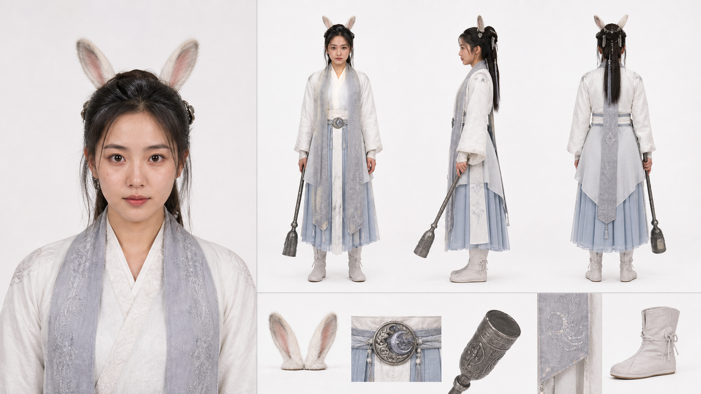

### 人物側寫

- **性別**：女
- **年齡**：固定妖身外觀約二十至三十歲（推斷）
- **身分**：廣寒宮搗藥玉兔，下界冒充天竺公主並企圖招唐三藏為駙馬
- 記仇 / 靈活 / 善偽裝 / 驕傲 / 好勝

**外貌**　約二十五歲的東亞女性玉兔妖固定人形，圓潤長臉、明亮警覺眼神，頭頂有一對短白兔耳實體妝效，身形輕巧但成熟。穿月白短戰袍、銀灰披帛與淡藍分片裙，腰佩月紋，手持長柄搗藥杵，穿白灰軟靴。（推斷）

**性情**　宮廷中端莊明快，暴露後身法輕疾、言語帶嘲諷；對舊怨長期不放。

**動機**　報復素娥前世的一掌之仇，奪取公主生活並以唐三藏婚配提升自身。

**角色弧線**　她把真公主拋入荒野後冒名生活，拋繡球選中唐三藏；戰敗現出玉兔來歷，最後由太陰星君帶回月宮。

**人物關係**

- 太陰星君 — 最終前來收回她的月宮主人
- 唐三藏 — 她企圖招為駙馬的對象
- 天竺真公主 — 被她報復、取代身分的素娥轉世

**原文依據**

> 廣寒宮裏搗藥杵，打人一下命歸泉。」

> 破，就於宮中現身捉獲。他就脫了人衣、首飾，使一條短棍，喚名搗藥杵，與我

> 兔兒，恐那國王不信，敢煩太陰君同眾仙妹將玉兔兒拿到那廂，對國王明證明

> 身來。那玉兔兒懷恨前仇，所以於舊年間偷開玉關金鎖走下來，把素娥攝拋荒

### 造型

**畫風**　擬真實拍明代神魔劇試裝定妝照，月白、銀灰、淡藍與冷銀

`live-action`, `photographic`, `wardrobe camera test`, `character sheet`, `real skin texture`, `85mm lens`, `practical creature prosthetics`

**生圖提示詞 EN**

```text
Live-action photography, not illustration: a real wardrobe camera-test photograph of a real human being on a film production, shot on a full-frame cinema camera with a 50-85mm lens at a moderate aperture against a neutral warm-gray seamless studio backdrop, the finish and honesty of a costume-department test still. a twenty-five-year-old East Asian woman in a fixed practical moon-rabbit spirit form for a Ming-dynasty Chinese supernatural drama, rounded long face, bright alert eyes, a pair of short natural white rabbit ears integrated into the hair, light agile adult build and one consistent identity She wears a moon-white short battle robe, silver-gray stole, pale-blue divided skirt, subtle lunar waist motif, white-gray soft boots and carries a long practical medicine-pounding pestle. Three-quarter waist-up portrait, identity in sharpest focus, soft-box key from upper left and gentle cool fill. True photographic skin: real visible pores, fine vellus hair, uneven natural tone, faint capillaries at the nostrils and ear rims, genuine subsurface scattering, moles and freckles left in place, no beauty retouching and no skin smoothing; eyes with a real catchlight from the key light, moist lower lid, resolvable iris fibres and a limbal ring; eyebrows and eyelids honestly asymmetric; loose individual hair strands catching the light and breaking the silhouette. Real garments with true cloth weight, visible weave, stitched seams and hems, natural drape, self-shadowing folds and honest wear at cuffs, elbows and knees. No illustration, CGI, text or watermark.
```

擬真實拍明代神魔劇試裝定妝照：約二十五歲的東亞女性玉兔妖固定人形，圓潤長臉、明亮警覺眼神，頭頂有一對短白兔耳實體妝效，身形輕巧但成熟。穿月白短戰袍、銀灰披帛與淡藍分片裙，腰佩月紋，手持長柄搗藥杵，穿白灰軟靴。暖灰棚拍背景，左上柔光箱主光，保留自然材質、磨損與實拍細節。

**負向提示詞**

```text
illustration, painting, drawing, sketch, anime, manga, cartoon, cel shading, digital painting brush strokes, CGI, 3d game render, plastic or waxy skin, doll skin, beauty-filter retouching, poreless airbrushed complexion, perfectly symmetrical face, dead flat eyes without a catchlight, wig-like helmet hair with no loose strands, flat untextured costume fabric, cheap cosplay-shop garment, stiff mannequin posing, modern clothing, Qing dynasty queue, generic western fantasy, extra fingers, malformed hands, text, watermark, signature, busy or patterned background, harsh cast shadows on the backdrop, child body, male actor, sexualized bunny costume, modern rabbit-girl outfit, giant cartoon ears, animal mascot head, multiple faces
```

**角色設定圖提示詞 EN**

```text
Use case: historical-scene. Asset type: live-action production character model sheet. Create ONE 16:9 landscape canvas. CHARACTER: a twenty-five-year-old East Asian woman in a fixed practical moon-rabbit spirit form for a Ming-dynasty Chinese supernatural drama, rounded long face, bright alert eyes, a pair of short natural white rabbit ears integrated into the hair, light agile adult build and one consistent identity She wears a moon-white short battle robe, silver-gray stole, pale-blue divided skirt, subtle lunar waist motif, white-gray soft boots and carries a long practical medicine-pounding pestle. Divide the canvas into three zones with thin hairline rules. LEFT ZONE, about 34% of the width: one large front-facing head-and-shoulders bust, centred like an ID photograph, both shoulders fully visible with clear side margins, clean straight horizontal bottom cut. This is the facial identity anchor. LIGHTING IN THE LEFT ZONE ONLY: a large soft-box key from the upper left with gentle bounce fill and real ambient occlusion under chin, in eye sockets and at the collar. RIGHT-TOP ZONE: exactly three equal-height FULL-BODY views of the SAME actor or creature performer, true front, strict 90-degree left profile and true back, on a shared ground line. They must match the bust exactly in face, age, body, hair, prosthetics, garments, colours and footwear. PROPORTIONS ARE CRITICAL: correct anatomy and limb lengths, clear margins above head and below feet, no stretching, squashing or foreshortening. LIGHTING IN THE RIGHT ZONES: flat even frontal studio light, no directional key and no cast shadows on the backdrop. RIGHT-BOTTOM ZONE: four to five small isolated detail studies: short white rabbit ear prosthetic, lunar waist motif, medicine-pounding pestle head, silver-gray stole edge, white-gray soft boot. Details are smaller than figures; if space is tight extend them down the right edge; the detail studies give way, not the figures. Plain pure white background, generous even margins, no scenery, no written labels, no text, no watermark, no extra people. Live-action photography, not illustration: a real wardrobe camera-test photograph of a real human being on a film production, shot on a full-frame cinema camera with a 50-85mm lens at a moderate aperture against a neutral warm-gray seamless studio backdrop, the finish and honesty of a costume-department test still. True photographic skin: real visible pores, fine vellus hair, uneven natural tone, faint capillaries at the nostrils and ear rims, genuine subsurface scattering, moles and freckles left in place, no beauty retouching and no skin smoothing; eyes with a real catchlight from the key light, moist lower lid, resolvable iris fibres and a limbal ring; eyebrows and eyelids honestly asymmetric; loose individual hair strands catching the light and breaking the silhouette. Real garments with true cloth weight, visible weave, stitched seams and hems, natural drape, self-shadowing folds and honest wear at cuffs, elbows and knees.
```

### 聲音

- **音色**：清亮敏捷的年輕女中音
- **音高**：中高音
- **語速**：快而輕，動怒時字尾變硬
- **口音**：月宮清雅語感混天竺宮廷語調（推斷）
- **情緒**：驕傲、機敏、記仇
- **類比**：像一位在宮廷禮數下藏著多年報復心的敏捷武者

**配音提示詞 EN**

```text
A young adult female mezzo voice, mid-high pitch, clear agile resonance, refined court diction with quick light pacing, hardening at phrase endings when old resentment surfaces.
```

約二十五歲的清亮女中音，音高偏中高、節奏輕快；帶宮廷語感，提及舊怨時字尾突然變硬。

---

## 地湧夫人（金鼻白毛老鼠精、半截觀音、地湧夫人）

> 主要角色 · 以地下洞府、替身遺骸與反覆變化拖延追兵，把求婚與吞食企圖藏在精密逃脫路線中。

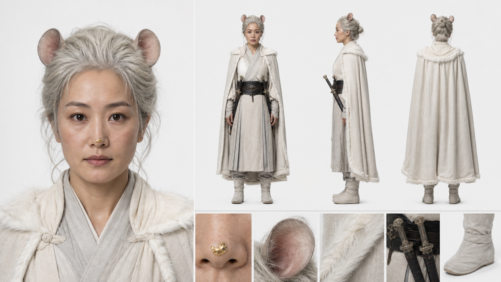

### 人物側寫

- **性別**：女
- **年齡**：固定妖身外觀約二十五至三十五歲（推斷）
- **身分**：陷空山無底洞白毛老鼠精，冒認李天王父子為親並擄走唐三藏
- 機警 / 擅逃遁 / 善偽裝 / 執著 / 會利用名號

**外貌**　約三十歲的東亞女性白鼠妖固定人形，窄圓臉、鼻尖微帶金色實體妝，白灰髮絲中露短圓鼠耳，身形纖捷但成年。穿象牙灰窄袖洞府長衣、墨黑護腰與白毛邊披肩，配雙短劍、金色鼻飾與灰白軟靴。（推斷）

**性情**　面對唐三藏柔聲周旋，遇追捕立即切換替身與地道；壓力越大越依賴假身份。

**動機**　占有唐三藏並藉其元陽增進修為，同時利用天界義親名號逃避追究。

**角色弧線**　她先在鎮海寺害僧，再擄唐三藏入無底洞，多次以替身與變化脫逃；悟空查出供奉牌位後由李天王、哪吒收伏。

**人物關係**

- 唐三藏 — 她擄入洞府並企圖婚配的目標
- 孫悟空 — 追入無底洞、查出其天界關係的對手
- 托塔李天王 — 被她供作義父、最後奉旨收伏她的人

**原文依據**

> 名字：他的本身出處，喚做金鼻白毛老鼠精；因偷香花寶燭，改名喚做半截觀

> 音；如今饒他下界，又改了，喚做地湧夫人是也。」

### 造型

**畫風**　擬真實拍明代神魔劇試裝定妝照，象牙灰、墨黑、白毛與微金

`live-action`, `photographic`, `wardrobe camera test`, `character sheet`, `real skin texture`, `85mm lens`, `practical creature prosthetics`

**生圖提示詞 EN**

```text
Live-action photography, not illustration: a real wardrobe camera-test photograph of a real human being on a film production, shot on a full-frame cinema camera with a 50-85mm lens at a moderate aperture against a neutral warm-gray seamless studio backdrop, the finish and honesty of a costume-department test still. a thirty-year-old East Asian woman in a fixed practical white-mouse spirit form for a Ming-dynasty Chinese supernatural drama, narrow-round face, subtle natural gold colouring at the nose, short rounded mouse ears emerging from white-gray hair, agile adult build and one consistent identity She wears an ivory-gray narrow-sleeved subterranean robe, ink-black waist guard, restrained white-fur-edged mantle, gray-white soft boots and paired short swords, with a tiny practical gold nose ornament. Three-quarter waist-up portrait, identity in sharpest focus, soft-box key from upper left and gentle cool fill. True photographic skin: real visible pores, fine vellus hair, uneven natural tone, faint capillaries at the nostrils and ear rims, genuine subsurface scattering, moles and freckles left in place, no beauty retouching and no skin smoothing; eyes with a real catchlight from the key light, moist lower lid, resolvable iris fibres and a limbal ring; eyebrows and eyelids honestly asymmetric; loose individual hair strands catching the light and breaking the silhouette. Real garments with true cloth weight, visible weave, stitched seams and hems, natural drape, self-shadowing folds and honest wear at cuffs, elbows and knees. No illustration, CGI, text or watermark.
```

擬真實拍明代神魔劇試裝定妝照：約三十歲的東亞女性白鼠妖固定人形，窄圓臉、鼻尖微帶金色實體妝，白灰髮絲中露短圓鼠耳，身形纖捷但成年。穿象牙灰窄袖洞府長衣、墨黑護腰與白毛邊披肩，配雙短劍、金色鼻飾與灰白軟靴。暖灰棚拍背景，左上柔光箱主光，保留自然材質、磨損與實拍細節。

**負向提示詞**

```text
illustration, painting, drawing, sketch, anime, manga, cartoon, cel shading, digital painting brush strokes, CGI, 3d game render, plastic or waxy skin, doll skin, beauty-filter retouching, poreless airbrushed complexion, perfectly symmetrical face, dead flat eyes without a catchlight, wig-like helmet hair with no loose strands, flat untextured costume fabric, cheap cosplay-shop garment, stiff mannequin posing, modern clothing, Qing dynasty queue, generic western fantasy, extra fingers, malformed hands, text, watermark, signature, busy or patterned background, harsh cast shadows on the backdrop, child body, male actor, sexualized mouse costume, cartoon mascot, whisker face paint, giant ears, luxury palace princess
```

**角色設定圖提示詞 EN**

```text
Use case: historical-scene. Asset type: live-action production character model sheet. Create ONE 16:9 landscape canvas. CHARACTER: a thirty-year-old East Asian woman in a fixed practical white-mouse spirit form for a Ming-dynasty Chinese supernatural drama, narrow-round face, subtle natural gold colouring at the nose, short rounded mouse ears emerging from white-gray hair, agile adult build and one consistent identity She wears an ivory-gray narrow-sleeved subterranean robe, ink-black waist guard, restrained white-fur-edged mantle, gray-white soft boots and paired short swords, with a tiny practical gold nose ornament. Divide the canvas into three zones with thin hairline rules. LEFT ZONE, about 34% of the width: one large front-facing head-and-shoulders bust, centred like an ID photograph, both shoulders fully visible with clear side margins, clean straight horizontal bottom cut. This is the facial identity anchor. LIGHTING IN THE LEFT ZONE ONLY: a large soft-box key from the upper left with gentle bounce fill and real ambient occlusion under chin, in eye sockets and at the collar. RIGHT-TOP ZONE: exactly three equal-height FULL-BODY views of the SAME actor or creature performer, true front, strict 90-degree left profile and true back, on a shared ground line. They must match the bust exactly in face, age, body, hair, prosthetics, garments, colours and footwear. PROPORTIONS ARE CRITICAL: correct anatomy and limb lengths, clear margins above head and below feet, no stretching, squashing or foreshortening. LIGHTING IN THE RIGHT ZONES: flat even frontal studio light, no directional key and no cast shadows on the backdrop. RIGHT-BOTTOM ZONE: four to five small isolated detail studies: subtle gold nose ornament, short rounded mouse-ear prosthetic, restrained white-fur edge, paired short-sword hilt, gray-white soft boot. Details are smaller than figures; if space is tight extend them down the right edge; the detail studies give way, not the figures. Plain pure white background, generous even margins, no scenery, no written labels, no text, no watermark, no extra people. Live-action photography, not illustration: a real wardrobe camera-test photograph of a real human being on a film production, shot on a full-frame cinema camera with a 50-85mm lens at a moderate aperture against a neutral warm-gray seamless studio backdrop, the finish and honesty of a costume-department test still. True photographic skin: real visible pores, fine vellus hair, uneven natural tone, faint capillaries at the nostrils and ear rims, genuine subsurface scattering, moles and freckles left in place, no beauty retouching and no skin smoothing; eyes with a real catchlight from the key light, moist lower lid, resolvable iris fibres and a limbal ring; eyebrows and eyelids honestly asymmetric; loose individual hair strands catching the light and breaking the silhouette. Real garments with true cloth weight, visible weave, stitched seams and hems, natural drape, self-shadowing folds and honest wear at cuffs, elbows and knees.
```

### 聲音

- **音色**：柔滑偏低的成年女中音
- **音高**：中音
- **語速**：誘導時慢，逃遁時極快
- **口音**：洞府口音混寺院模仿語調（推斷）
- **情緒**：討好、戒備、急智
- **類比**：像一位一句柔話之間已經安排好三條地道退路的逃脫者

**配音提示詞 EN**

```text
A mature female mezzo voice, mid pitch, smooth low-edged timbre, slow ingratiating persuasion that accelerates sharply under pursuit, guarded improvisation and calculated charm.
```

約三十歲的柔滑女中音，音高居中略低；勸誘時緩慢，受追捕便急速變節奏，討好下始終保持戒備。

---

## 玉面公主（玉面狐狸、萬歲狐王之女）

> 主要角色 · 以繼承財產與洞府生活換取牛魔王保護，卻也因此成為夫妻衝突與借扇戰局中的脆弱節點。

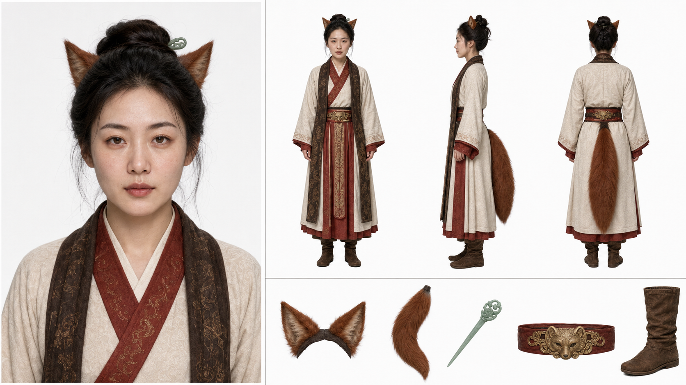

### 人物側寫

- **性別**：女
- **年齡**：約二十五至三十五歲的成年女性形象（推斷）
- **身分**：積雷山摩雲洞狐王之女，以家財招牛魔王入贅的狐妖
- 自尊 / 重享受 / 有佔有欲 / 精明 / 依賴保護

**外貌**　約二十九歲的東亞女性狐妖固定人形，玉白長橢圓臉、眼尾微挑，髮後有低調赤褐狐耳，姿態成熟自持。穿玉白與赭紅相間的交領錦袍、暗金狐紋腰帶與深褐披帛，配赤褐狐尾實體妝效、玉簪與褐色軟靴。（推斷）

**性情**　在熟悉洞府中傲慢挑剔，遭外敵時倚賴牛魔王；面對正妻勢力帶有不安與競爭心。

**動機**　保住父親留下的家產、洞府與伴侶，維持自己在妖界的生活地位。

**角色弧線**　她以財富招牛魔王長住摩雲洞，成為鐵扇公主婚姻裂痕的一部分；悟空尋牛魔王時衝突升高，她最終死於八戒之手。

**人物關係**

- 牛魔王 — 受其財產吸引而入贅、提供保護的伴侶
- 鐵扇公主 — 與她爭奪牛魔王位置的正妻
- 豬八戒 — 攻入摩雲洞並殺死她的敵人

**原文依據**

> 了，遺下一個女兒，叫做玉面公主。那公主有百萬家私，無人掌管。二年

> 「非敢拋撇，只因玉面公主招後，家事繁冗，朋友多顧，是以稽留在外，卻

> 並一個長嘴大耳的和尚，同火焰山土地等眾廝殺哩。」玉面公主聽言，即命

> 徑飛到那玉面狐狸頭上，拔下一根毫毛，吹口仙氣，叫：「變！」變作一個瞌睡

### 造型

**畫風**　擬真實拍明代神魔劇試裝定妝照，玉白、赭紅、暗金與深褐

`live-action`, `photographic`, `wardrobe camera test`, `character sheet`, `real skin texture`, `85mm lens`, `practical creature prosthetics`

**生圖提示詞 EN**

```text
Live-action photography, not illustration: a real wardrobe camera-test photograph of a real human being on a film production, shot on a full-frame cinema camera with a 50-85mm lens at a moderate aperture against a neutral warm-gray seamless studio backdrop, the finish and honesty of a costume-department test still. a twenty-nine-year-old East Asian woman in a fixed practical fox-spirit form for a Ming-dynasty Chinese supernatural drama, pale jade-toned long oval face, subtly lifted eyes, restrained russet fox ears integrated behind the hair, mature self-possessed posture and one consistent identity She wears jade-white and ochre-red crossed brocade robes, a muted-gold fox-motif belt, dark-brown stole, brown soft boots, one practical russet fox tail and a simple jade hairpin. Three-quarter waist-up portrait, identity in sharpest focus, soft-box key from upper left and gentle cool fill. True photographic skin: real visible pores, fine vellus hair, uneven natural tone, faint capillaries at the nostrils and ear rims, genuine subsurface scattering, moles and freckles left in place, no beauty retouching and no skin smoothing; eyes with a real catchlight from the key light, moist lower lid, resolvable iris fibres and a limbal ring; eyebrows and eyelids honestly asymmetric; loose individual hair strands catching the light and breaking the silhouette. Real garments with true cloth weight, visible weave, stitched seams and hems, natural drape, self-shadowing folds and honest wear at cuffs, elbows and knees. No illustration, CGI, text or watermark.
```

擬真實拍明代神魔劇試裝定妝照：約二十九歲的東亞女性狐妖固定人形，玉白長橢圓臉、眼尾微挑，髮後有低調赤褐狐耳，姿態成熟自持。穿玉白與赭紅相間的交領錦袍、暗金狐紋腰帶與深褐披帛，配赤褐狐尾實體妝效、玉簪與褐色軟靴。暖灰棚拍背景，左上柔光箱主光，保留自然材質、磨損與實拍細節。

**負向提示詞**

```text
illustration, painting, drawing, sketch, anime, manga, cartoon, cel shading, digital painting brush strokes, CGI, 3d game render, plastic or waxy skin, doll skin, beauty-filter retouching, poreless airbrushed complexion, perfectly symmetrical face, dead flat eyes without a catchlight, wig-like helmet hair with no loose strands, flat untextured costume fabric, cheap cosplay-shop garment, stiff mannequin posing, modern clothing, Qing dynasty queue, generic western fantasy, extra fingers, malformed hands, text, watermark, signature, busy or patterned background, harsh cast shadows on the backdrop, childlike face, male actor, sexualized fox-girl outfit, multiple tails, giant cartoon ears, western fur bikini, generic princess crown
```

**角色設定圖提示詞 EN**

```text
Use case: historical-scene. Asset type: live-action production character model sheet. Create ONE 16:9 landscape canvas. CHARACTER: a twenty-nine-year-old East Asian woman in a fixed practical fox-spirit form for a Ming-dynasty Chinese supernatural drama, pale jade-toned long oval face, subtly lifted eyes, restrained russet fox ears integrated behind the hair, mature self-possessed posture and one consistent identity She wears jade-white and ochre-red crossed brocade robes, a muted-gold fox-motif belt, dark-brown stole, brown soft boots, one practical russet fox tail and a simple jade hairpin. Divide the canvas into three zones with thin hairline rules. LEFT ZONE, about 34% of the width: one large front-facing head-and-shoulders bust, centred like an ID photograph, both shoulders fully visible with clear side margins, clean straight horizontal bottom cut. This is the facial identity anchor. LIGHTING IN THE LEFT ZONE ONLY: a large soft-box key from the upper left with gentle bounce fill and real ambient occlusion under chin, in eye sockets and at the collar. RIGHT-TOP ZONE: exactly three equal-height FULL-BODY views of the SAME actor or creature performer, true front, strict 90-degree left profile and true back, on a shared ground line. They must match the bust exactly in face, age, body, hair, prosthetics, garments, colours and footwear. PROPORTIONS ARE CRITICAL: correct anatomy and limb lengths, clear margins above head and below feet, no stretching, squashing or foreshortening. LIGHTING IN THE RIGHT ZONES: flat even frontal studio light, no directional key and no cast shadows on the backdrop. RIGHT-BOTTOM ZONE: four to five small isolated detail studies: restrained russet fox-ear prosthetic, single practical fox tail, jade hairpin, muted-gold fox belt motif, brown soft boot. Details are smaller than figures; if space is tight extend them down the right edge; the detail studies give way, not the figures. Plain pure white background, generous even margins, no scenery, no written labels, no text, no watermark, no extra people. Live-action photography, not illustration: a real wardrobe camera-test photograph of a real human being on a film production, shot on a full-frame cinema camera with a 50-85mm lens at a moderate aperture against a neutral warm-gray seamless studio backdrop, the finish and honesty of a costume-department test still. True photographic skin: real visible pores, fine vellus hair, uneven natural tone, faint capillaries at the nostrils and ear rims, genuine subsurface scattering, moles and freckles left in place, no beauty retouching and no skin smoothing; eyes with a real catchlight from the key light, moist lower lid, resolvable iris fibres and a limbal ring; eyebrows and eyelids honestly asymmetric; loose individual hair strands catching the light and breaking the silhouette. Real garments with true cloth weight, visible weave, stitched seams and hems, natural drape, self-shadowing folds and honest wear at cuffs, elbows and knees.
```

### 聲音

- **音色**：柔亮而自持的成年女中音
- **音高**：中音
- **語速**：平時慢，受威脅時句子變碎
- **口音**：西域洞府富家語感（推斷）
- **情緒**：矜持、佔有、不安
- **類比**：像一位知道財產能換來保護、卻不確定保護能維持多久的繼承人

**配音提示詞 EN**

```text
A mature female mezzo voice, mid pitch, polished bright tone, slow entitled cadence that fragments under threat, possessive confidence layered over insecurity.
```

約二十九歲的柔亮女中音，音高居中、語速偏慢；有富家自持感，受威脅時句子會變碎，顯出依賴下的不安。

---

## 孫悟空（孫行者、悟空、行者、齊天大聖、美猴王）

> 主角 · 以洞察變化、極強戰力與反權威本能守護取經隊伍，在緊箍與責任中把自由轉化為承擔。

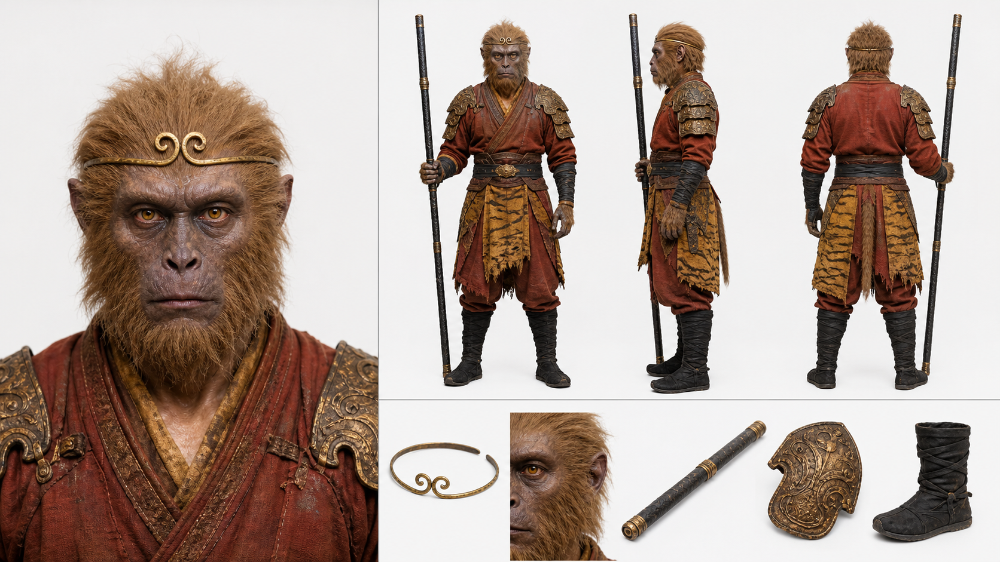

### 人物側寫

- **性別**：男
- **年齡**：非人長生者；固定外觀為成年雄性靈猴（推斷）
- **身分**：花果山石猴、齊天大聖，受緊箍約束保護唐三藏西行
- 機敏 / 勇猛 / 好勝 / 反權威 / 重承諾

**外貌**　固定為成年雄性獼猴靈身，金棕短毛、深色裸面、亮金褐眼，身形精瘦有爆發力，額戴金箍。穿赭紅短戰袍、暗金護肩、虎黃腰裙與黑色綁腿靴，手持深鐵色金箍棒，保留可實拍的猴面與手部妝效。（推斷）

**性情**　反應極快、愛嘲諷，識破妖怪時不耐迂迴；對師父誤解會受傷，仍多次回頭救援。

**動機**　先求自由與名位，取經途中逐漸把保護師父、完成承諾與證明判斷力放在同一條路上。

**角色弧線**　從石猴出世、大鬧天宮、被壓五行山，到受戒護送唐僧；一路在衝突、逐出與召回中學會以能力承擔群體任務。

**人物關係**

- 唐三藏 — 以緊箍與信任相互牽制的師父
- 豬八戒 — 互相挖苦又協力作戰的師弟
- 觀音菩薩 — 設下緊箍並多次提供收伏線索的引導者

**原文依據**

> 王」。自此，石猿高登王位，將「石」字兒隱了，遂稱「美猴王」。有詩為證。

> 是，你問怎麼？」那猴道：「我是五百年前大鬧天宮的齊天大聖，只因犯了誑上

> 即令取墨筆來，濃磨香翰，飽潤香毫，牒文之後，寫上孫悟空、豬悟能、沙悟淨

> 真經，甚有功果，加陞大職正果，汝為旃檀功德佛。──孫悟空，汝因大鬧天

### 造型

**畫風**　擬真實拍明代神魔劇試裝定妝照，赭紅、虎黃、暗金與深鐵

`live-action`, `photographic`, `wardrobe camera test`, `character sheet`, `real skin texture`, `85mm lens`, `practical creature prosthetics`

**生圖提示詞 EN**

```text
Live-action photography, not illustration: a real wardrobe camera-test photograph of a real human being on a film production, shot on a full-frame cinema camera with a 50-85mm lens at a moderate aperture against a neutral warm-gray seamless studio backdrop, the finish and honesty of a costume-department test still. an adult male macaque spirit portrayed with coherent practical simian prosthetics in a Ming-dynasty Chinese supernatural drama, short golden-brown fur, dark expressive bare face, bright amber-brown eyes, lean explosive body and a fitted gold circlet, one consistent creature identity He wears an ochre-red short battle robe, restrained antique-gold shoulder protection, tiger-yellow waist panels, black wrapped boots and carries a dark iron staff with narrow gold bands; practical simian face and hand prosthetics remain believable. Three-quarter waist-up portrait, identity in sharpest focus, soft-box key from upper left and gentle cool fill. True photographic skin: real visible pores, fine vellus hair, uneven natural tone, faint capillaries at the nostrils and ear rims, genuine subsurface scattering, moles and freckles left in place, no beauty retouching and no skin smoothing; eyes with a real catchlight from the key light, moist lower lid, resolvable iris fibres and a limbal ring; eyebrows and eyelids honestly asymmetric; loose individual hair strands catching the light and breaking the silhouette. Real garments with true cloth weight, visible weave, stitched seams and hems, natural drape, self-shadowing folds and honest wear at cuffs, elbows and knees. No illustration, CGI, text or watermark.
```

擬真實拍明代神魔劇試裝定妝照：固定為成年雄性獼猴靈身，金棕短毛、深色裸面、亮金褐眼，身形精瘦有爆發力，額戴金箍。穿赭紅短戰袍、暗金護肩、虎黃腰裙與黑色綁腿靴，手持深鐵色金箍棒，保留可實拍的猴面與手部妝效。暖灰棚拍背景，左上柔光箱主光，保留自然材質、磨損與實拍細節。

**負向提示詞**

```text
illustration, painting, drawing, sketch, anime, manga, cartoon, cel shading, digital painting brush strokes, CGI, 3d game render, plastic or waxy skin, doll skin, beauty-filter retouching, poreless airbrushed complexion, perfectly symmetrical face, dead flat eyes without a catchlight, wig-like helmet hair with no loose strands, flat untextured costume fabric, cheap cosplay-shop garment, stiff mannequin posing, modern clothing, Qing dynasty queue, generic western fantasy, extra fingers, malformed hands, text, watermark, signature, busy or patterned background, harsh cast shadows on the backdrop, human face, gorilla body, child monkey, cartoon mascot, bright opera makeup, modern superhero armour, multiple monkeys
```

**角色設定圖提示詞 EN**

```text
Use case: historical-scene. Asset type: live-action production character model sheet. Create ONE 16:9 landscape canvas. CHARACTER: an adult male macaque spirit portrayed with coherent practical simian prosthetics in a Ming-dynasty Chinese supernatural drama, short golden-brown fur, dark expressive bare face, bright amber-brown eyes, lean explosive body and a fitted gold circlet, one consistent creature identity He wears an ochre-red short battle robe, restrained antique-gold shoulder protection, tiger-yellow waist panels, black wrapped boots and carries a dark iron staff with narrow gold bands; practical simian face and hand prosthetics remain believable. Divide the canvas into three zones with thin hairline rules. LEFT ZONE, about 34% of the width: one large front-facing head-and-shoulders bust, centred like an ID photograph, both shoulders fully visible with clear side margins, clean straight horizontal bottom cut. This is the facial identity anchor. LIGHTING IN THE LEFT ZONE ONLY: a large soft-box key from the upper left with gentle bounce fill and real ambient occlusion under chin, in eye sockets and at the collar. RIGHT-TOP ZONE: exactly three equal-height FULL-BODY views of the SAME actor or creature performer, true front, strict 90-degree left profile and true back, on a shared ground line. They must match the bust exactly in face, age, body, hair, prosthetics, garments, colours and footwear. PROPORTIONS ARE CRITICAL: correct anatomy and limb lengths, clear margins above head and below feet, no stretching, squashing or foreshortening. LIGHTING IN THE RIGHT ZONES: flat even frontal studio light, no directional key and no cast shadows on the backdrop. RIGHT-BOTTOM ZONE: four to five small isolated detail studies: fitted gold circlet, practical simian facial fur edge, dark iron staff with gold bands, antique-gold shoulder plate, black wrapped boot. Details are smaller than figures; if space is tight extend them down the right edge; the detail studies give way, not the figures. Plain pure white background, generous even margins, no scenery, no written labels, no text, no watermark, no extra people. Live-action photography, not illustration: a real wardrobe camera-test photograph of a real human being on a film production, shot on a full-frame cinema camera with a 50-85mm lens at a moderate aperture against a neutral warm-gray seamless studio backdrop, the finish and honesty of a costume-department test still. True photographic skin: real visible pores, fine vellus hair, uneven natural tone, faint capillaries at the nostrils and ear rims, genuine subsurface scattering, moles and freckles left in place, no beauty retouching and no skin smoothing; eyes with a real catchlight from the key light, moist lower lid, resolvable iris fibres and a limbal ring; eyebrows and eyelids honestly asymmetric; loose individual hair strands catching the light and breaking the silhouette. Real garments with true cloth weight, visible weave, stitched seams and hems, natural drape, self-shadowing folds and honest wear at cuffs, elbows and knees.
```

### 聲音

- **音色**：明亮帶砂感的成年男中音
- **音高**：中高音
- **語速**：極快，嘲諷時跳躍，決斷時短促
- **口音**：花果山野性語感混天界詞彙（推斷）
- **情緒**：自信、警醒、受誤解時尖銳
- **類比**：像一位總比眾人早一步看出偽裝、又忍不住把答案喊出來的斥候

**配音提示詞 EN**

```text
An adult male high baritone, bright gritty edge, rapid agile pacing, playful taunts that snap into clipped command, alert confidence and a sharp wounded note when mistrusted.
```

成年男中高音，聲線明亮帶砂；語速極快，嘲諷跳躍、決斷短促，被誤解時會露出尖銳受傷感。

---

## 唐三藏（唐僧、三藏、玄奘、御弟）

> 主角 · 以戒律、慈悲與堅定使命維持西行方向，卻也因凡人視野與過度信任外表反覆陷入危機。

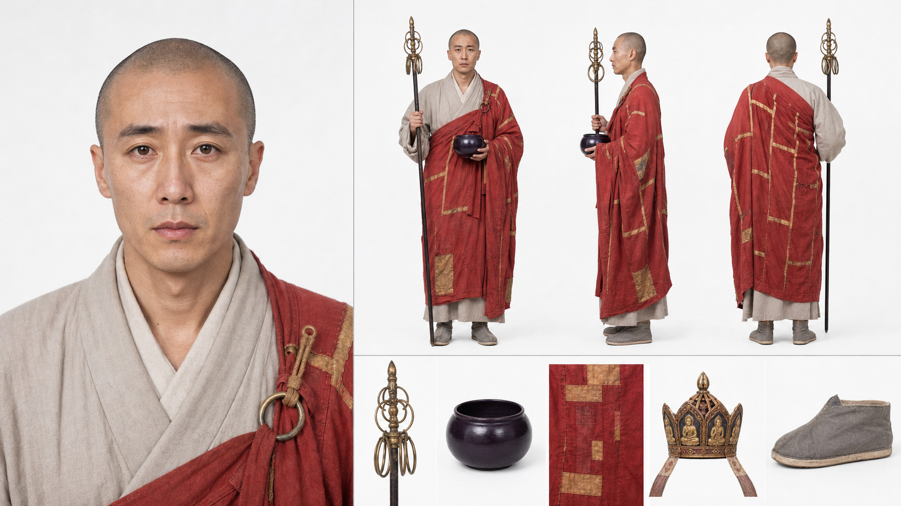

### 人物側寫

- **性別**：男
- **年齡**：約三十至四十歲（推斷）
- **身分**：大唐御弟玄奘法師，奉命西行求取真經的取經人
- 虔誠 / 慈悲 / 堅毅 / 守戒 / 有時固執

**外貌**　約三十五歲的東亞男性僧人，長圓清瘦臉、眉目溫和而易顯憂色，剃髮，身形修長。穿赭紅錦襴袈裟覆灰白僧衣，戴五佛冠作法會版本但平時可卸，持九環錫杖與紫金缽盂，穿素灰僧鞋。（推斷）

**性情**　平時溫和講理，觸及殺生與戒律便轉為嚴厲；恐懼真實存在，但不因此放棄目的地。

**動機**　完成唐王所託、取得大乘真經普度東土，並以持戒保住取經的正當性。

**角色弧線**　他從長安出發，經歷擄掠、誘惑與師徒衝突，在一次次受救後逐步理解護法方式；最終抵達靈山取得真經。

**人物關係**

- 孫悟空 — 最強護法，也是他最常誤解與逐出的弟子
- 豬八戒 — 常以凡俗需求動搖隊伍的二徒弟
- 女兒國國王 — 真誠求婚、使其面對情感抉擇的君主

**原文依據**

> 貪淫樂禍，多殺多爭，正所謂口舌兇場，是非惡海。我今有三藏真經，可以勸人

> 那人道：「他明早出朝來也。」三藏問：「出朝作甚？」那人道：「明日早朝，

> 所以失陪。」三藏道：「貧僧素手進拜，怎麼敢勞賜齋？」道士笑云：「你我都

> 麼菩薩再去捉弄他人。”唐僧道：“當時只為你難管，故以此法制之。今已成佛

### 造型

**畫風**　擬真實拍明代神魔劇試裝定妝照，赭紅、灰白、低彩金與暗紫

`live-action`, `photographic`, `wardrobe camera test`, `character sheet`, `real skin texture`, `85mm lens`

**生圖提示詞 EN**

```text
Live-action photography, not illustration: a real wardrobe camera-test photograph of a real human being on a film production, shot on a full-frame cinema camera with a 50-85mm lens at a moderate aperture against a neutral warm-gray seamless studio backdrop, the finish and honesty of a costume-department test still. a thirty-five-year-old East Asian male Buddhist monk from Tang China represented in a Ming-dynasty drama, lean long-round clean-shaven face, gentle worried eyes, shaved head and slender upright body He wears a weathered vermilion kasaya with restrained gold patchwork over gray-white monastic robes, removable five-Buddha ritual crown, plain gray monk shoes, and carries a nine-ring staff and a dark-purple alms bowl. Three-quarter waist-up portrait, identity in sharpest focus, soft-box key from upper left and gentle cool fill. True photographic skin: real visible pores, fine vellus hair, uneven natural tone, faint capillaries at the nostrils and ear rims, genuine subsurface scattering, moles and freckles left in place, no beauty retouching and no skin smoothing; eyes with a real catchlight from the key light, moist lower lid, resolvable iris fibres and a limbal ring; eyebrows and eyelids honestly asymmetric; loose individual hair strands catching the light and breaking the silhouette. Real garments with true cloth weight, visible weave, stitched seams and hems, natural drape, self-shadowing folds and honest wear at cuffs, elbows and knees. No illustration, CGI, text or watermark.
```

擬真實拍明代神魔劇試裝定妝照：約三十五歲的東亞男性僧人，長圓清瘦臉、眉目溫和而易顯憂色，剃髮，身形修長。穿赭紅錦襴袈裟覆灰白僧衣，戴五佛冠作法會版本但平時可卸，持九環錫杖與紫金缽盂，穿素灰僧鞋。暖灰棚拍背景，左上柔光箱主光，保留自然材質、磨損與實拍細節。

**負向提示詞**

```text
illustration, painting, drawing, sketch, anime, manga, cartoon, cel shading, digital painting brush strokes, CGI, 3d game render, plastic or waxy skin, doll skin, beauty-filter retouching, poreless airbrushed complexion, perfectly symmetrical face, dead flat eyes without a catchlight, wig-like helmet hair with no loose strands, flat untextured costume fabric, cheap cosplay-shop garment, stiff mannequin posing, modern clothing, Qing dynasty queue, generic western fantasy, extra fingers, malformed hands, text, watermark, signature, busy or patterned background, harsh cast shadows on the backdrop, long hair, beard, muscular warrior, luxurious emperor robe, eroticized monk, modern Buddhist uniform
```

**角色設定圖提示詞 EN**

```text
Use case: historical-scene. Asset type: live-action production character model sheet. Create ONE 16:9 landscape canvas. CHARACTER: a thirty-five-year-old East Asian male Buddhist monk from Tang China represented in a Ming-dynasty drama, lean long-round clean-shaven face, gentle worried eyes, shaved head and slender upright body He wears a weathered vermilion kasaya with restrained gold patchwork over gray-white monastic robes, removable five-Buddha ritual crown, plain gray monk shoes, and carries a nine-ring staff and a dark-purple alms bowl. Divide the canvas into three zones with thin hairline rules. LEFT ZONE, about 34% of the width: one large front-facing head-and-shoulders bust, centred like an ID photograph, both shoulders fully visible with clear side margins, clean straight horizontal bottom cut. This is the facial identity anchor. LIGHTING IN THE LEFT ZONE ONLY: a large soft-box key from the upper left with gentle bounce fill and real ambient occlusion under chin, in eye sockets and at the collar. RIGHT-TOP ZONE: exactly three equal-height FULL-BODY views of the SAME actor or creature performer, true front, strict 90-degree left profile and true back, on a shared ground line. They must match the bust exactly in face, age, body, hair, prosthetics, garments, colours and footwear. PROPORTIONS ARE CRITICAL: correct anatomy and limb lengths, clear margins above head and below feet, no stretching, squashing or foreshortening. LIGHTING IN THE RIGHT ZONES: flat even frontal studio light, no directional key and no cast shadows on the backdrop. RIGHT-BOTTOM ZONE: four to five small isolated detail studies: nine-ring staff head, dark-purple alms bowl, kasaya gold patchwork, removable ritual crown, plain gray monk shoe. Details are smaller than figures; if space is tight extend them down the right edge; the detail studies give way, not the figures. Plain pure white background, generous even margins, no scenery, no written labels, no text, no watermark, no extra people. Live-action photography, not illustration: a real wardrobe camera-test photograph of a real human being on a film production, shot on a full-frame cinema camera with a 50-85mm lens at a moderate aperture against a neutral warm-gray seamless studio backdrop, the finish and honesty of a costume-department test still. True photographic skin: real visible pores, fine vellus hair, uneven natural tone, faint capillaries at the nostrils and ear rims, genuine subsurface scattering, moles and freckles left in place, no beauty retouching and no skin smoothing; eyes with a real catchlight from the key light, moist lower lid, resolvable iris fibres and a limbal ring; eyebrows and eyelids honestly asymmetric; loose individual hair strands catching the light and breaking the silhouette. Real garments with true cloth weight, visible weave, stitched seams and hems, natural drape, self-shadowing folds and honest wear at cuffs, elbows and knees.
```

### 聲音

- **音色**：溫和清正的成年男中音
- **音高**：中音
- **語速**：誦念平穩，責備時變緊
- **口音**：長安僧院官話語感（推斷）
- **情緒**：慈悲、憂懼、使命堅定
- **類比**：像一位會因眼前生命停步、也會為遠方誓願繼續走的僧人

**配音提示詞 EN**

```text
A mature male baritone, mid pitch, clean gentle resonance, formal monastic diction, even sutra-like pacing that tightens in moral rebuke, compassion and fear held inside firm purpose.
```

約三十五歲的清正男中音，音高居中；誦念平穩，責備時節奏變緊，慈悲與憂懼都受取經誓願約束。

---

## 豬八戒（八戒、悟能、豬悟能、天蓬元帥）

> 主角 · 把飢餓、慾望、抱怨與實用戰力全帶進隊伍，在退縮與出手之間形成最有人間煙火的拉扯。

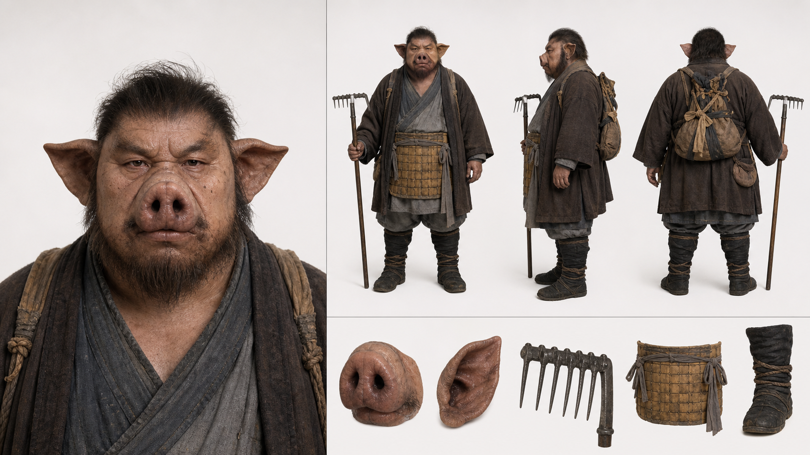

### 人物側寫

- **性別**：男
- **年齡**：非人長生者；固定外觀為成年雄性豬妖（推斷）
- **身分**：原天蓬元帥、投錯豬胎後受戒護送唐三藏的二徒弟
- 貪吃 / 好色 / 怕苦 / 有戰力 / 會調和氣氛

**外貌**　固定為成年雄性豬妖人形，黑褐短鬃、寬大豬鼻與大耳為實體妝效，身形高胖厚重但具武將力量。穿深褐短袍、灰藍內衣與土黃護腰，束行李帶，持九齒釘鈀，穿黑褐綁腿靴。（推斷）

**性情**　先抱怨再評估，遇到食物與婚配容易分心；真到危急仍常回身作戰，也能用市井語言拆穿宏大話術。

**動機**　想以最少辛苦換得安穩、食物與認可，同時不願真正失去師徒共同體。

**角色弧線**　從高老莊被收伏加入西行，屢次提出散伙、誤會悟空或受誘惑，卻也在水戰與搬山等任務中不可替代，最終受封淨壇使者。

**人物關係**

- 孫悟空 — 互相嘲弄、競爭又依賴的師兄
- 唐三藏 — 既服從又常用抱怨影響的師父
- 沙悟淨 — 共同挑擔、作戰並承受師兄壓力的同伴

**原文依據**

> 頂受戒，指身為姓，就姓了豬﹔替他起了法名，就叫做豬悟能。遂此領命歸真，

> 息妖火，捉這潑怪。」八戒道：「哥哥放心前去，我等理會得。」

> 八戒道：「你不見師兄把他些衣服都搶將來也？」行者放下道：「此乃妖精穿的

> 多官遂各各捧著，隨太宗駕幸寺中，搭起高臺，鋪設齊整。長老仍命八戒、沙僧

### 造型

**畫風**　擬真實拍明代神魔劇試裝定妝照，深褐、灰藍、土黃與黑鐵

`live-action`, `photographic`, `wardrobe camera test`, `character sheet`, `real skin texture`, `85mm lens`, `practical creature prosthetics`

**生圖提示詞 EN**

```text
Live-action photography, not illustration: a real wardrobe camera-test photograph of a real human being on a film production, shot on a full-frame cinema camera with a 50-85mm lens at a moderate aperture against a neutral warm-gray seamless studio backdrop, the finish and honesty of a costume-department test still. an adult male boar spirit portrayed with coherent practical pig prosthetics in a Ming-dynasty Chinese supernatural drama, broad natural snout, large ears, short black-brown bristles, heavy tall body with former-general strength and one consistent creature identity He wears a dark-brown short travel robe over gray-blue layers, earth-yellow waist guard, luggage straps, black-brown wrapped boots and carries a practical nine-toothed iron rake. Three-quarter waist-up portrait, identity in sharpest focus, soft-box key from upper left and gentle cool fill. True photographic skin: real visible pores, fine vellus hair, uneven natural tone, faint capillaries at the nostrils and ear rims, genuine subsurface scattering, moles and freckles left in place, no beauty retouching and no skin smoothing; eyes with a real catchlight from the key light, moist lower lid, resolvable iris fibres and a limbal ring; eyebrows and eyelids honestly asymmetric; loose individual hair strands catching the light and breaking the silhouette. Real garments with true cloth weight, visible weave, stitched seams and hems, natural drape, self-shadowing folds and honest wear at cuffs, elbows and knees. No illustration, CGI, text or watermark.
```

擬真實拍明代神魔劇試裝定妝照：固定為成年雄性豬妖人形，黑褐短鬃、寬大豬鼻與大耳為實體妝效，身形高胖厚重但具武將力量。穿深褐短袍、灰藍內衣與土黃護腰，束行李帶，持九齒釘鈀，穿黑褐綁腿靴。暖灰棚拍背景，左上柔光箱主光，保留自然材質、磨損與實拍細節。

**負向提示詞**

```text
illustration, painting, drawing, sketch, anime, manga, cartoon, cel shading, digital painting brush strokes, CGI, 3d game render, plastic or waxy skin, doll skin, beauty-filter retouching, poreless airbrushed complexion, perfectly symmetrical face, dead flat eyes without a catchlight, wig-like helmet hair with no loose strands, flat untextured costume fabric, cheap cosplay-shop garment, stiff mannequin posing, modern clothing, Qing dynasty queue, generic western fantasy, extra fingers, malformed hands, text, watermark, signature, busy or patterned background, harsh cast shadows on the backdrop, cute pig mascot, child body, pink cartoon skin, obese helpless caricature, exposed belly, modern overalls, multiple pigs
```

**角色設定圖提示詞 EN**

```text
Use case: historical-scene. Asset type: live-action production character model sheet. Create ONE 16:9 landscape canvas. CHARACTER: an adult male boar spirit portrayed with coherent practical pig prosthetics in a Ming-dynasty Chinese supernatural drama, broad natural snout, large ears, short black-brown bristles, heavy tall body with former-general strength and one consistent creature identity He wears a dark-brown short travel robe over gray-blue layers, earth-yellow waist guard, luggage straps, black-brown wrapped boots and carries a practical nine-toothed iron rake. Divide the canvas into three zones with thin hairline rules. LEFT ZONE, about 34% of the width: one large front-facing head-and-shoulders bust, centred like an ID photograph, both shoulders fully visible with clear side margins, clean straight horizontal bottom cut. This is the facial identity anchor. LIGHTING IN THE LEFT ZONE ONLY: a large soft-box key from the upper left with gentle bounce fill and real ambient occlusion under chin, in eye sockets and at the collar. RIGHT-TOP ZONE: exactly three equal-height FULL-BODY views of the SAME actor or creature performer, true front, strict 90-degree left profile and true back, on a shared ground line. They must match the bust exactly in face, age, body, hair, prosthetics, garments, colours and footwear. PROPORTIONS ARE CRITICAL: correct anatomy and limb lengths, clear margins above head and below feet, no stretching, squashing or foreshortening. LIGHTING IN THE RIGHT ZONES: flat even frontal studio light, no directional key and no cast shadows on the backdrop. RIGHT-BOTTOM ZONE: four to five small isolated detail studies: practical pig snout prosthetic, large ear edge, nine-toothed rake head, earth-yellow waist guard, black-brown wrapped boot. Details are smaller than figures; if space is tight extend them down the right edge; the detail studies give way, not the figures. Plain pure white background, generous even margins, no scenery, no written labels, no text, no watermark, no extra people. Live-action photography, not illustration: a real wardrobe camera-test photograph of a real human being on a film production, shot on a full-frame cinema camera with a 50-85mm lens at a moderate aperture against a neutral warm-gray seamless studio backdrop, the finish and honesty of a costume-department test still. True photographic skin: real visible pores, fine vellus hair, uneven natural tone, faint capillaries at the nostrils and ear rims, genuine subsurface scattering, moles and freckles left in place, no beauty retouching and no skin smoothing; eyes with a real catchlight from the key light, moist lower lid, resolvable iris fibres and a limbal ring; eyebrows and eyelids honestly asymmetric; loose individual hair strands catching the light and breaking the silhouette. Real garments with true cloth weight, visible weave, stitched seams and hems, natural drape, self-shadowing folds and honest wear at cuffs, elbows and knees.
```

### 聲音

- **音色**：厚鼻音的成年男中低音
- **音高**：中低音
- **語速**：抱怨時快，盤算時拖長
- **口音**：北方市井語感（推斷）
- **情緒**：滑稽、焦慮、務實
- **類比**：像一位一邊喊累一邊已把最重行李扛起來的老兵

**配音提示詞 EN**

```text
An adult male bass-baritone with a thick nasal edge, low-mid pitch, fast comic complaints and drawn-out bargaining, practical anxiety over a durable former-soldier core.
```

成年男中低音，鼻腔感厚；抱怨時快、盤算時拖長，滑稽與焦慮下仍有老兵般的耐力。

---

## 沙悟淨（沙僧、悟淨、捲簾大將）

> 主角 · 以沉默耐力、秩序感與穩定戰力維持隊伍，是爭吵與危機之間最可靠的承重結構。

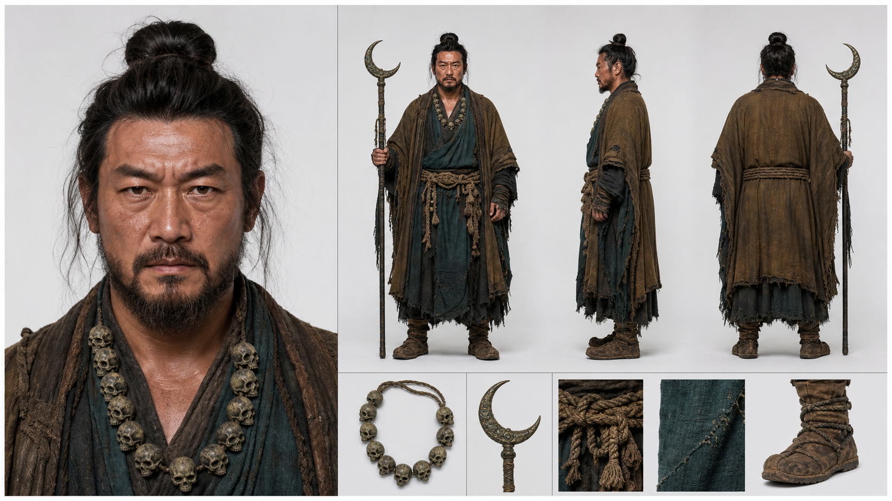

### 人物側寫

- **性別**：男
- **年齡**：非人長生者；固定外觀為成年男性妖仙（推斷）
- **身分**：原捲簾大將、流沙河妖怪，受戒後護送唐三藏並主要承擔行李
- 沉穩 / 忠誠 / 耐苦 / 少言 / 重秩序

**外貌**　固定為成年東亞男性妖仙形態，約四十歲外觀，膚色受流沙風蝕呈赤褐，長方臉、濃眉、捲曲短鬚，身形高大結實。穿暗赭與河青交疊僧戰衣、粗繩護腰，頸戴九枚骷髏念珠的道具化版本，持降妖寶杖，穿沙褐重靴。（推斷）

**性情**　很少搶話，通常先做再報告；師兄衝突時多勸回任務本身，真正動怒時語句短而沉。

**動機**　贖回天界失職之罪，完成護送責任並維持師徒隊伍不致散裂。

**角色弧線**　他從流沙河食人妖被觀音收伏，加入後長期負重、守師與水戰；個人戲份較少，卻以持續可靠完成修行。

**人物關係**

- 唐三藏 — 長期近身守護並承擔行李的師父
- 孫悟空 — 服從其戰術、也會調停衝突的師兄
- 豬八戒 — 共同作戰與抬擔、性格互補的師兄

**原文依據**

> ﹔起個法名，叫做個沙悟淨。當時入了沙門，送菩薩過了河，他洗心滌慮，再不

> 皇，竭誠酬答。」禮拜畢，遂教悟淨背馬，趁冰過河。陳老又道：「莫忙，待幾

> 卻說三藏在那山坡下正與沙僧盼望，只見八戒喘呵呵的跑來。三藏大驚道：

> 個有受用的品級，如何不好？──沙悟淨，汝本是捲簾大將。先因蟠桃會上打碎

### 造型

**畫風**　擬真實拍明代神魔劇試裝定妝照，暗赭、河青、沙褐與骨白

`live-action`, `photographic`, `wardrobe camera test`, `character sheet`, `real skin texture`, `85mm lens`, `practical creature makeup`

**生圖提示詞 EN**

```text
Live-action photography, not illustration: a real wardrobe camera-test photograph of a real human being on a film production, shot on a full-frame cinema camera with a 50-85mm lens at a moderate aperture against a neutral warm-gray seamless studio backdrop, the finish and honesty of a costume-department test still. an adult East Asian male river-demon ascetic with apparent age around forty in a Ming-dynasty Chinese supernatural drama, wind-weathered red-brown complexion, rectangular face, heavy brows, curled short beard, very tall solid build and one consistent identity He wears layered dark-ochre and river-teal monastic battle robes, coarse rope waist binding, a restrained practical necklace of nine weathered skull-shaped relic beads, sand-brown heavy boots and carries a crescent-ended demon-subduing staff. Three-quarter waist-up portrait, identity in sharpest focus, soft-box key from upper left and gentle cool fill. True photographic skin: real visible pores, fine vellus hair, uneven natural tone, faint capillaries at the nostrils and ear rims, genuine subsurface scattering, moles and freckles left in place, no beauty retouching and no skin smoothing; eyes with a real catchlight from the key light, moist lower lid, resolvable iris fibres and a limbal ring; eyebrows and eyelids honestly asymmetric; loose individual hair strands catching the light and breaking the silhouette. Real garments with true cloth weight, visible weave, stitched seams and hems, natural drape, self-shadowing folds and honest wear at cuffs, elbows and knees. No illustration, CGI, text or watermark.
```

擬真實拍明代神魔劇試裝定妝照：固定為成年東亞男性妖仙形態，約四十歲外觀，膚色受流沙風蝕呈赤褐，長方臉、濃眉、捲曲短鬚，身形高大結實。穿暗赭與河青交疊僧戰衣、粗繩護腰，頸戴九枚骷髏念珠的道具化版本，持降妖寶杖，穿沙褐重靴。暖灰棚拍背景，左上柔光箱主光，保留自然材質、磨損與實拍細節。

**負向提示詞**

```text
illustration, painting, drawing, sketch, anime, manga, cartoon, cel shading, digital painting brush strokes, CGI, 3d game render, plastic or waxy skin, doll skin, beauty-filter retouching, poreless airbrushed complexion, perfectly symmetrical face, dead flat eyes without a catchlight, wig-like helmet hair with no loose strands, flat untextured costume fabric, cheap cosplay-shop garment, stiff mannequin posing, modern clothing, Qing dynasty queue, generic western fantasy, extra fingers, malformed hands, text, watermark, signature, busy or patterned background, harsh cast shadows on the backdrop, blue western genie, graphic human skull gore, giant bodybuilder, exposed chest, luxurious armour, identical pig or monkey features
```

**角色設定圖提示詞 EN**

```text
Use case: historical-scene. Asset type: live-action production character model sheet. Create ONE 16:9 landscape canvas. CHARACTER: an adult East Asian male river-demon ascetic with apparent age around forty in a Ming-dynasty Chinese supernatural drama, wind-weathered red-brown complexion, rectangular face, heavy brows, curled short beard, very tall solid build and one consistent identity He wears layered dark-ochre and river-teal monastic battle robes, coarse rope waist binding, a restrained practical necklace of nine weathered skull-shaped relic beads, sand-brown heavy boots and carries a crescent-ended demon-subduing staff. Divide the canvas into three zones with thin hairline rules. LEFT ZONE, about 34% of the width: one large front-facing head-and-shoulders bust, centred like an ID photograph, both shoulders fully visible with clear side margins, clean straight horizontal bottom cut. This is the facial identity anchor. LIGHTING IN THE LEFT ZONE ONLY: a large soft-box key from the upper left with gentle bounce fill and real ambient occlusion under chin, in eye sockets and at the collar. RIGHT-TOP ZONE: exactly three equal-height FULL-BODY views of the SAME actor or creature performer, true front, strict 90-degree left profile and true back, on a shared ground line. They must match the bust exactly in face, age, body, hair, prosthetics, garments, colours and footwear. PROPORTIONS ARE CRITICAL: correct anatomy and limb lengths, clear margins above head and below feet, no stretching, squashing or foreshortening. LIGHTING IN THE RIGHT ZONES: flat even frontal studio light, no directional key and no cast shadows on the backdrop. RIGHT-BOTTOM ZONE: four to five small isolated detail studies: nine weathered skull-shaped relic beads, crescent staff head, coarse rope waist binding, river-teal cloth seam, sand-brown heavy boot. Details are smaller than figures; if space is tight extend them down the right edge; the detail studies give way, not the figures. Plain pure white background, generous even margins, no scenery, no written labels, no text, no watermark, no extra people. Live-action photography, not illustration: a real wardrobe camera-test photograph of a real human being on a film production, shot on a full-frame cinema camera with a 50-85mm lens at a moderate aperture against a neutral warm-gray seamless studio backdrop, the finish and honesty of a costume-department test still. True photographic skin: real visible pores, fine vellus hair, uneven natural tone, faint capillaries at the nostrils and ear rims, genuine subsurface scattering, moles and freckles left in place, no beauty retouching and no skin smoothing; eyes with a real catchlight from the key light, moist lower lid, resolvable iris fibres and a limbal ring; eyebrows and eyelids honestly asymmetric; loose individual hair strands catching the light and breaking the silhouette. Real garments with true cloth weight, visible weave, stitched seams and hems, natural drape, self-shadowing folds and honest wear at cuffs, elbows and knees.
```

### 聲音

- **音色**：沉厚穩定的成年男低音
- **音高**：低音
- **語速**：慢而均勻，勸阻時略加重
- **口音**：天界軍職官話混河西粗音（推斷）
- **情緒**：克制、可靠、忍耐
- **類比**：像一位不參與爭吵、只提醒大家擔子還在路上的老兵

**配音提示詞 EN**

```text
A mature male bass, low pitch, deep steady resonance, slow even cadence with extra weight in mediation, restrained loyalty and immense endurance.
```

約四十歲的沉厚男低音，音域低、節奏慢而均勻；平時少言，勸阻時加重句尾，傳達可靠與耐苦。

---

## 如來佛祖（如來、佛祖、釋迦如來）

> 主要角色 · 以幾乎不動聲色的絕對尺度處理天界失序，將取經從懲罰、修行與文化傳遞整合成制度。

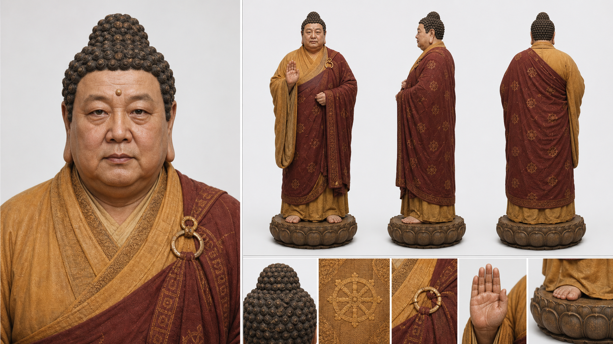

### 人物側寫

- **性別**：男
- **年齡**：超越人類年齡；外貌約五十至六十歲的成年男性形象（推斷）
- **身分**：靈山最高權威，鎮壓悟空並主持真經授予與最終封授
- 威嚴 / 沉著 / 洞察 / 重秩序 / 具慈悲

**外貌**　外貌約五十五歲的東亞男性佛陀形象，圓闊臉、眉眼沉靜，短捲髮髻與頭頂肉髻採克制實體妝效，體態寬厚。穿赭金與暗紅層疊袈裟，織低調法輪紋，赤足坐於簡潔蓮座，手作施無畏印，不配武器。（推斷）

**性情**　不提高音量，以問題與比喻讓對手自己暴露尺度差；裁決簡短，幾乎沒有情緒性動作。

**動機**　維持三界秩序，使大乘經典按因果傳入東土，並讓參與者經歷足夠考驗後獲得相稱位置。

**角色弧線**　他以掌中佛國鎮壓大鬧天宮的悟空，後指示觀音尋取經人；在靈山驗收八十一難並封授師徒。

**人物關係**

- 觀音菩薩 — 奉其旨意規畫東土取經的執行者
- 孫悟空 — 被其鎮壓、最後受封的反叛者
- 唐三藏 — 抵達靈山、承受驗收並取得真經的人

**原文依據**

> 萬相歸真從一理，如來同契住雙林。

> 回頭看，原來是比丘尼尊者。大聖作禮道：「正有一事，欲見如來。」比丘尼

> 「如來，若這般比論，你還是妖精的外甥哩。」如來道：「那怪須是我去，方

> 五聖果位之時，諸眾佛祖、菩薩、聖僧、羅漢、揭諦、比丘、優婆夷塞、各山各

### 造型

**畫風**　擬真實拍明代神魔劇試裝定妝照，赭金、暗紅、骨白與低彩金

`live-action`, `photographic`, `wardrobe camera test`, `character sheet`, `real skin texture`, `85mm lens`

**生圖提示詞 EN**

```text
Live-action photography, not illustration: a real wardrobe camera-test photograph of a real human being on a film production, shot on a full-frame cinema camera with a 50-85mm lens at a moderate aperture against a neutral warm-gray seamless studio backdrop, the finish and honesty of a costume-department test still. an East Asian male Buddha figure with apparent age around fifty-five in a Ming-dynasty Chinese supernatural drama, broad round face, utterly calm eyes, restrained practical curled hair and cranial ushnisha, substantial seated body and quiet absolute authority He wears layered ochre-gold and dark-red Buddhist robes with subtle dharma-wheel weaving, bare feet on a simple lotus seat and one hand in a restrained reassurance gesture, with no weapon. Three-quarter waist-up portrait, identity in sharpest focus, soft-box key from upper left and gentle cool fill. True photographic skin: real visible pores, fine vellus hair, uneven natural tone, faint capillaries at the nostrils and ear rims, genuine subsurface scattering, moles and freckles left in place, no beauty retouching and no skin smoothing; eyes with a real catchlight from the key light, moist lower lid, resolvable iris fibres and a limbal ring; eyebrows and eyelids honestly asymmetric; loose individual hair strands catching the light and breaking the silhouette. Real garments with true cloth weight, visible weave, stitched seams and hems, natural drape, self-shadowing folds and honest wear at cuffs, elbows and knees. No illustration, CGI, text or watermark.
```

擬真實拍明代神魔劇試裝定妝照：外貌約五十五歲的東亞男性佛陀形象，圓闊臉、眉眼沉靜，短捲髮髻與頭頂肉髻採克制實體妝效，體態寬厚。穿赭金與暗紅層疊袈裟，織低調法輪紋，赤足坐於簡潔蓮座，手作施無畏印，不配武器。暖灰棚拍背景，左上柔光箱主光，保留自然材質、磨損與實拍細節。

**負向提示詞**

```text
illustration, painting, drawing, sketch, anime, manga, cartoon, cel shading, digital painting brush strokes, CGI, 3d game render, plastic or waxy skin, doll skin, beauty-filter retouching, poreless airbrushed complexion, perfectly symmetrical face, dead flat eyes without a catchlight, wig-like helmet hair with no loose strands, flat untextured costume fabric, cheap cosplay-shop garment, stiff mannequin posing, modern clothing, Qing dynasty queue, generic western fantasy, extra fingers, malformed hands, text, watermark, signature, busy or patterned background, harsh cast shadows on the backdrop, western wizard, giant glowing halo, ornate emperor crown, bodybuilder, exposed torso, caricature fat monk, weapon
```

**角色設定圖提示詞 EN**

```text
Use case: historical-scene. Asset type: live-action production character model sheet. Create ONE 16:9 landscape canvas. CHARACTER: an East Asian male Buddha figure with apparent age around fifty-five in a Ming-dynasty Chinese supernatural drama, broad round face, utterly calm eyes, restrained practical curled hair and cranial ushnisha, substantial seated body and quiet absolute authority He wears layered ochre-gold and dark-red Buddhist robes with subtle dharma-wheel weaving, bare feet on a simple lotus seat and one hand in a restrained reassurance gesture, with no weapon. Divide the canvas into three zones with thin hairline rules. LEFT ZONE, about 34% of the width: one large front-facing head-and-shoulders bust, centred like an ID photograph, both shoulders fully visible with clear side margins, clean straight horizontal bottom cut. This is the facial identity anchor. LIGHTING IN THE LEFT ZONE ONLY: a large soft-box key from the upper left with gentle bounce fill and real ambient occlusion under chin, in eye sockets and at the collar. RIGHT-TOP ZONE: exactly three equal-height FULL-BODY views of the SAME actor or creature performer, true front, strict 90-degree left profile and true back, on a shared ground line. They must match the bust exactly in face, age, body, hair, prosthetics, garments, colours and footwear. PROPORTIONS ARE CRITICAL: correct anatomy and limb lengths, clear margins above head and below feet, no stretching, squashing or foreshortening. LIGHTING IN THE RIGHT ZONES: flat even frontal studio light, no directional key and no cast shadows on the backdrop. RIGHT-BOTTOM ZONE: four to five small isolated detail studies: restrained curled hair and ushnisha, subtle dharma-wheel weave, robe clasp, reassurance hand gesture, bare foot and lotus edge. Details are smaller than figures; if space is tight extend them down the right edge; the detail studies give way, not the figures. Plain pure white background, generous even margins, no scenery, no written labels, no text, no watermark, no extra people. Live-action photography, not illustration: a real wardrobe camera-test photograph of a real human being on a film production, shot on a full-frame cinema camera with a 50-85mm lens at a moderate aperture against a neutral warm-gray seamless studio backdrop, the finish and honesty of a costume-department test still. True photographic skin: real visible pores, fine vellus hair, uneven natural tone, faint capillaries at the nostrils and ear rims, genuine subsurface scattering, moles and freckles left in place, no beauty retouching and no skin smoothing; eyes with a real catchlight from the key light, moist lower lid, resolvable iris fibres and a limbal ring; eyebrows and eyelids honestly asymmetric; loose individual hair strands catching the light and breaking the silhouette. Real garments with true cloth weight, visible weave, stitched seams and hems, natural drape, self-shadowing folds and honest wear at cuffs, elbows and knees.
```

### 聲音

- **音色**：寬厚無壓迫感的成年男低音
- **音高**：低音
- **語速**：極慢，句間留白長
- **口音**：清晰超地域的儀式語感（推斷）
- **情緒**：平靜、洞察、裁決明確
- **類比**：像一位不需提高聲音便能重新定義整場衝突尺度的最高裁決者

**配音提示詞 EN**

```text
A mature male bass, low pitch, broad effortless resonance, very slow ceremonial cadence with long silence between clauses, serene insight and final judgment without anger.
```

外貌約五十五歲的寬厚男低音，音域低、句間留白長；聲音不具壓迫動作，卻有不可動搖的裁決感。

---

## 牛魔王（大力牛魔王、牛王、平天大聖）

> 主要角色 · 以巨大力量、妖界人脈與家族關係維持多處領地，卻在婚姻裂痕與借扇衝突中被各方圍攻。

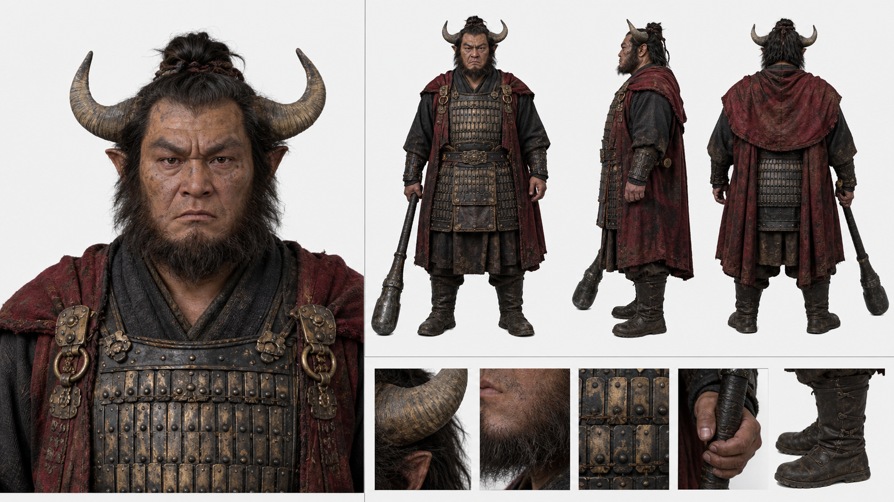

### 人物側寫

- **性別**：男
- **年齡**：非人長生者；固定外觀為成年雄性牛妖（推斷）
- **身分**：積雷山與翠雲山勢力核心、鐵扇公主丈夫、紅孩兒父親
- 強悍 / 自負 / 重面子 / 善交遊 / 感情失序

**外貌**　固定為成年雄性牛妖人形，約四十五歲外觀，黑褐短毛沿下顎與頸側延伸，額生一對向外牛角，身形極高壯。穿深炭黑厚戰袍、暗銅重札甲與血紅披肩，束粗皮腰帶，持混鐵棍，穿黑褐重靴。（推斷）

**性情**　平時豪飲結交、講究身份，受挑戰後直接以力量回應；對妻妾衝突多逃避而非調停。

**動機**　保住領地、名聲與自主生活，不讓天界或舊友把家族法寶當成可隨意調用之物。

**角色弧線**　他從悟空昔日結義兄長變成借扇事件的主要阻力，周旋於鐵扇與玉面之間；最終在天兵、佛門與師徒合圍下被擒。

**人物關係**

- 鐵扇公主 — 疏遠但共享家族與法寶危機的正妻
- 玉面公主 — 因財產而入贅摩雲洞的伴侶
- 孫悟空 — 昔日結義、後因借扇全面交戰的對手

**原文依據**

> 廣交賢友。此時又會了個七弟兄，乃牛魔王、蛟魔王、鵬魔王、獅狔王、獼猴王

> 怪我耶？」牛王罵道：「這個乖嘴的猢猻！害子之情，被你說過；你才欺我

> 施威噴彩霧，牛王放潑吐毫光。齊鬥勇，兩不良，咬牙剉齒氣昂昂。播土揚

> 路是他前番襲牛魔王盜金睛獸走熟了的。直至那宮闕之下，橫爬過去，又見

### 造型

**畫風**　擬真實拍明代神魔劇試裝定妝照，深炭黑、暗銅、血紅與黑褐

`live-action`, `photographic`, `wardrobe camera test`, `character sheet`, `real skin texture`, `85mm lens`, `practical creature prosthetics`

**生圖提示詞 EN**

```text
Live-action photography, not illustration: a real wardrobe camera-test photograph of a real human being on a film production, shot on a full-frame cinema camera with a 50-85mm lens at a moderate aperture against a neutral warm-gray seamless studio backdrop, the finish and honesty of a costume-department test still. an adult male ox demon with apparent age around forty-five portrayed through coherent practical prosthetics in a Ming-dynasty Chinese supernatural drama, dark-brown short fur along jaw and neck, one symmetrical pair of outward-curving ox horns, extremely tall massive body and one consistent identity He wears a deep-charcoal heavy battle robe, muted-bronze reinforced lamellar armour, blood-red shoulder mantle, thick leather belt, black-brown heavy boots and carries a solid dark iron cudgel. Three-quarter waist-up portrait, identity in sharpest focus, soft-box key from upper left and gentle cool fill. True photographic skin: real visible pores, fine vellus hair, uneven natural tone, faint capillaries at the nostrils and ear rims, genuine subsurface scattering, moles and freckles left in place, no beauty retouching and no skin smoothing; eyes with a real catchlight from the key light, moist lower lid, resolvable iris fibres and a limbal ring; eyebrows and eyelids honestly asymmetric; loose individual hair strands catching the light and breaking the silhouette. Real garments with true cloth weight, visible weave, stitched seams and hems, natural drape, self-shadowing folds and honest wear at cuffs, elbows and knees. No illustration, CGI, text or watermark.
```

擬真實拍明代神魔劇試裝定妝照：固定為成年雄性牛妖人形，約四十五歲外觀，黑褐短毛沿下顎與頸側延伸，額生一對向外牛角，身形極高壯。穿深炭黑厚戰袍、暗銅重札甲與血紅披肩，束粗皮腰帶，持混鐵棍，穿黑褐重靴。暖灰棚拍背景，左上柔光箱主光，保留自然材質、磨損與實拍細節。

**負向提示詞**

```text
illustration, painting, drawing, sketch, anime, manga, cartoon, cel shading, digital painting brush strokes, CGI, 3d game render, plastic or waxy skin, doll skin, beauty-filter retouching, poreless airbrushed complexion, perfectly symmetrical face, dead flat eyes without a catchlight, wig-like helmet hair with no loose strands, flat untextured costume fabric, cheap cosplay-shop garment, stiff mannequin posing, modern clothing, Qing dynasty queue, generic western fantasy, extra fingers, malformed hands, text, watermark, signature, busy or patterned background, harsh cast shadows on the backdrop, cow mascot head, minotaur bare chest, western plate armour, multiple horns, nose ring stereotype, cartoon bull, changing faces
```

**角色設定圖提示詞 EN**

```text
Use case: historical-scene. Asset type: live-action production character model sheet. Create ONE 16:9 landscape canvas. CHARACTER: an adult male ox demon with apparent age around forty-five portrayed through coherent practical prosthetics in a Ming-dynasty Chinese supernatural drama, dark-brown short fur along jaw and neck, one symmetrical pair of outward-curving ox horns, extremely tall massive body and one consistent identity He wears a deep-charcoal heavy battle robe, muted-bronze reinforced lamellar armour, blood-red shoulder mantle, thick leather belt, black-brown heavy boots and carries a solid dark iron cudgel. Divide the canvas into three zones with thin hairline rules. LEFT ZONE, about 34% of the width: one large front-facing head-and-shoulders bust, centred like an ID photograph, both shoulders fully visible with clear side margins, clean straight horizontal bottom cut. This is the facial identity anchor. LIGHTING IN THE LEFT ZONE ONLY: a large soft-box key from the upper left with gentle bounce fill and real ambient occlusion under chin, in eye sockets and at the collar. RIGHT-TOP ZONE: exactly three equal-height FULL-BODY views of the SAME actor or creature performer, true front, strict 90-degree left profile and true back, on a shared ground line. They must match the bust exactly in face, age, body, hair, prosthetics, garments, colours and footwear. PROPORTIONS ARE CRITICAL: correct anatomy and limb lengths, clear margins above head and below feet, no stretching, squashing or foreshortening. LIGHTING IN THE RIGHT ZONES: flat even frontal studio light, no directional key and no cast shadows on the backdrop. RIGHT-BOTTOM ZONE: four to five small isolated detail studies: paired practical ox horn base, dark jaw fur edge, muted-bronze lamellar fastening, iron cudgel grip, black-brown heavy boot. Details are smaller than figures; if space is tight extend them down the right edge; the detail studies give way, not the figures. Plain pure white background, generous even margins, no scenery, no written labels, no text, no watermark, no extra people. Live-action photography, not illustration: a real wardrobe camera-test photograph of a real human being on a film production, shot on a full-frame cinema camera with a 50-85mm lens at a moderate aperture against a neutral warm-gray seamless studio backdrop, the finish and honesty of a costume-department test still. True photographic skin: real visible pores, fine vellus hair, uneven natural tone, faint capillaries at the nostrils and ear rims, genuine subsurface scattering, moles and freckles left in place, no beauty retouching and no skin smoothing; eyes with a real catchlight from the key light, moist lower lid, resolvable iris fibres and a limbal ring; eyebrows and eyelids honestly asymmetric; loose individual hair strands catching the light and breaking the silhouette. Real garments with true cloth weight, visible weave, stitched seams and hems, natural drape, self-shadowing folds and honest wear at cuffs, elbows and knees.
```

### 聲音

- **音色**：巨大胸腔共鳴的成年男低音
- **音高**：低音
- **語速**：平時寬慢，交戰時如短雷
- **口音**：西域妖王粗豪語感（推斷）
- **情緒**：自負、惱怒、重面子
- **類比**：像一位習慣以體格和名號讓全席讓路的地方霸主

**配音提示詞 EN**

```text
A mature male bass, very low pitch, huge chest resonance, broad leisurely cadence that breaks into thunder-short combat phrases, pride and territorial anger.
```

外貌約四十五歲的雄厚男低音，胸腔共鳴巨大；平時寬慢，交戰時短如雷擊，帶妖王自負與領地意識。

---

## 白龍馬（龍馬、小白龍、玉龍三太子）

> 主要角色 · 把被懲罰的龍族身分收束為長途負重與沉默護送，只有關鍵危局才重新顯露變化與戰力。

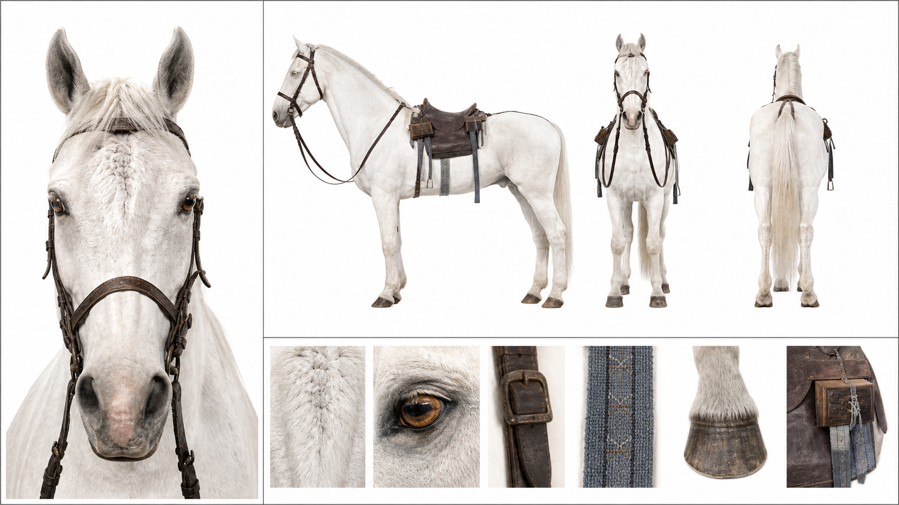

### 人物側寫

- **性別**：男
- **年齡**：非人長生龍族；固定為成年雄性龍馬（推斷）
- **身分**：西海龍王三太子，受戒後化白馬馱唐三藏西行
- 沉默 / 耐苦 / 忠於任務 / 克制 / 具隱藏戰力

**外貌**　固定為成年雄性白毛龍族駿馬，體型修長耐走，白毛帶微銀光，額中央有低調龍族骨脊，眼睛深琥珀色，四蹄完整。配磨舊深褐皮轡、灰藍織帶與素色唐代旅行鞍，鞍側留經箱固定帶，不配騎士與華麗馬鎧。（推斷）

**性情**　日常以動作而非言語回應，對驚嚇與飢渴有真實動物反應；化龍或人形出戰時則果斷。

**動機**　贖回縱火毀珠之罪，完成護送取經人的職責並重返天界秩序。

**角色弧線**　他吃掉唐僧原馬後被觀音收伏，長期化白馬負重西行；寶象國等危局曾化人出戰，最終受封八部天龍廣力菩薩。

**人物關係**

- 唐三藏 — 長期馱負並守護的師父
- 觀音菩薩 — 使其免死並安排贖罪任務的引導者
- 孫悟空 — 最初交戰、後共同護送的師兄

**原文依據**

> 軟蹄矬，戰兢兢的立站不住。蓋因那猴原是弼馬溫，在天上看養龍馬的，有些法

> ，右有悟淨捧托﹔孫行者在後面牽了龍馬，半雲半霧相跟﹔頭直上又有木叉擁護

> 六甲六丁等神、護教伽藍，同八戒、沙僧，（不領唐三藏，丟了白龍馬）各執兵

> 此時旃檀佛、鬥戰佛、淨壇使者、金身羅漢俱正果了本位，天龍馬亦自歸真。有

### 造型

**畫風**　擬真實拍明代神魔劇試裝定妝照，銀白、灰藍、深褐與琥珀

`live-action`, `photographic`, `wardrobe camera test`, `character sheet`, `real skin texture`, `85mm lens`, `quadruped creature sheet`, `practical creature design`

**生圖提示詞 EN**

```text
Live-action photography, not illustration: a real wardrobe camera-test photograph of a real human being on a film production, shot on a full-frame cinema camera with a 50-85mm lens at a moderate aperture against a neutral warm-gray seamless studio backdrop, the finish and honesty of a costume-department test still. an adult male white dragon-horse as a practical live-action quadruped creature for a Ming-dynasty Chinese supernatural drama, lean endurance-built equine body, white coat with subtle silver variation, a restrained central draconic brow ridge, deep amber eyes, consistent mane markings and all four hooves He wears weathered dark-brown leather bridle and reins, gray-blue woven straps and a plain Tang-travel saddle with scripture-box tie points, no rider and no ornate armour. Three-quarter waist-up portrait equivalent head-and-neck framing, identity in sharpest focus, soft-box key from upper left and gentle cool fill. Real animal coat, muzzle, eyes and tack with practical photographed texture. No illustration, CGI, text or watermark.
```

擬真實拍明代神魔劇試裝定妝照：固定為成年雄性白毛龍族駿馬，體型修長耐走，白毛帶微銀光，額中央有低調龍族骨脊，眼睛深琥珀色，四蹄完整。配磨舊深褐皮轡、灰藍織帶與素色唐代旅行鞍，鞍側留經箱固定帶，不配騎士與華麗馬鎧。暖灰棚拍背景，左上柔光箱主光，保留自然材質、磨損與實拍細節。

**負向提示詞**

```text
illustration, painting, drawing, sketch, anime, manga, cartoon, cel shading, digital painting brush strokes, CGI, 3d game render, plastic or waxy skin, doll skin, beauty-filter retouching, poreless airbrushed complexion, perfectly symmetrical face, dead flat eyes without a catchlight, wig-like helmet hair with no loose strands, flat untextured costume fabric, cheap cosplay-shop garment, stiff mannequin posing, modern clothing, Qing dynasty queue, generic western fantasy, extra fingers, malformed hands, text, watermark, signature, busy or patterned background, harsh cast shadows on the backdrop, human actor, rider, extra horse, unicorn horn, winged horse, ornate parade armour, cartoon pony, blue-white glowing fantasy creature
```

**角色設定圖提示詞 EN**

```text
Use case: historical-scene. Asset type: live-action production quadruped creature model sheet. Create ONE 16:9 landscape canvas. CREATURE: an adult male white dragon-horse as a practical live-action quadruped creature for a Ming-dynasty Chinese supernatural drama, lean endurance-built equine body, white coat with subtle silver variation, a restrained central draconic brow ridge, deep amber eyes, consistent mane markings and all four hooves He wears weathered dark-brown leather bridle and reins, gray-blue woven straps and a plain Tang-travel saddle with scripture-box tie points, no rider and no ornate armour. Divide the canvas into three zones with thin hairline rules. LEFT ZONE, about 34% of the width: one large front-facing head-and-neck portrait, both ears and the full muzzle visible with clear margins. This is the animal identity anchor. LIGHTING IN THE LEFT ZONE ONLY: a large soft-box key from the upper left with gentle bounce fill and real ambient occlusion around eyes, muzzle and tack. RIGHT-TOP ZONE: exactly three equal-scale FULL-BODY QUADRUPED views of the SAME animal, strict left side, true front and true rear, all four hooves visible on a shared ground line. Match coat markings, mane, eyes, tack and body proportions exactly. PROPORTIONS ARE CRITICAL: plausible equine anatomy, consistent leg length, clear margins above ears and below hooves, no stretching, squashing or foreshortening. LIGHTING IN THE RIGHT ZONES: flat even frontal studio light with no cast shadow on the backdrop. RIGHT-BOTTOM ZONE: four to five small isolated detail studies: restrained draconic brow ridge, deep amber eye, weathered leather bridle buckle, gray-blue woven strap, hoof and plain saddle tie point. Plain pure white background, generous even margins, no scenery, no written labels, no text, no watermark, no rider and no extra animals. Live-action practical creature photography, not illustration. Live-action photography, not illustration: a real wardrobe camera-test photograph of a real human being on a film production, shot on a full-frame cinema camera with a 50-85mm lens at a moderate aperture against a neutral warm-gray seamless studio backdrop, the finish and honesty of a costume-department test still. Real horse coat with individual hairs, natural skin around muzzle and eyes, worn leather and woven tack with true material weight.
```

### 聲音

- **音色**：低沉克制的成年雄性非語言聲響
- **音高**：中低音
- **語速**：平時以呼吸與短嘶回應，危機時急促
- **口音**：不適用人類口音
- **情緒**：耐苦、警醒、忠誠
- **類比**：以真實馬匹的鼻息、低嘶與蹄步表達，不作人類台詞

**配音提示詞 EN**

```text
An adult male equine nonverbal voice, low-mid register, restrained breath, soft snorts and brief neighs, steady travel rhythm accelerating only in danger; no spoken human language.
```

成年雄性龍馬的非語言聲響，音域中低；以呼吸、短嘶與蹄步表達耐苦和警醒，不說人類台詞。

---

## 二郎神（二郎顯聖真君、顯聖二郎真君、楊二郎）

> 主要角色 · 兼具天界正式武職與獨立行動風格，以第三眼、變化術和團隊獵捕能力處理最難收束的對手。

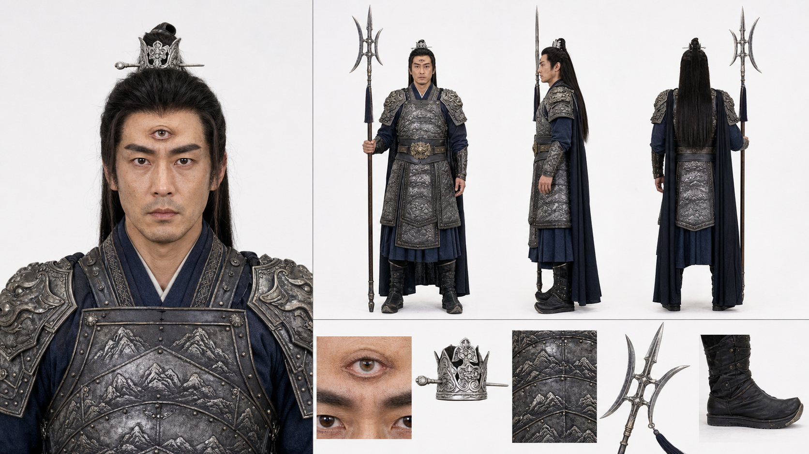

### 人物側寫

- **性別**：男
- **年齡**：約三十至四十歲的成年男性神將形象（推斷）
- **身分**：灌江口顯聖真君，以第三眼、變化與武藝參與擒悟空等天界任務
- 自信 / 冷靜 / 善追蹤 / 武藝高強 / 重同伴

**外貌**　約三十五歲的東亞男性神將，長方臉、濃眉、目光冷靜，額中央第三眼為精細實體妝效，身形高而精實。穿深銀灰山紋甲、墨藍戰袍與暗金護腰，戴窄幅銀冠，持三尖兩刃刀，穿黑色戰靴。（推斷）

**性情**　臨敵少廢話，先觀察變化規律再封鎖退路；與梅山兄弟協作自然，不靠官腔製造距離。

**動機**　完成天界委派、維持自身戰神名聲，並以真正技藝擊敗值得尊重的強敵。

**角色弧線**　他在天庭圍捕中以變化對變化追逼悟空，後來亦在取經路上受請協助降妖；從敵手成為可調用的高階盟友。

**人物關係**

- 孫悟空 — 變化與武藝旗鼓相當、由敵轉為可合作的對手
- 梅山六兄弟 — 長期協同追獵與作戰的部屬伙伴
- 玉皇大帝 — 接受調遣但保有灌江口獨立性的天界上位者

**原文依據**

> 菩薩道：「乃陛下令甥顯聖二郎真君，見居灌洲灌江口，享受下方香火。他昔

> 昭惠二郎神，齊天孫大聖。這個心高欺敵美猴王，那個面生壓伏真梁棟。兩個

> ，即教六丁、六甲將他解下，付與老君。老君領旨去訖。一壁廂宣二郎顯聖，

> 觀看，乃二郎顯聖，領梅山六兄弟，架著鷹犬，挑著狐兔，抬著獐鹿，一個

### 造型

**畫風**　擬真實拍明代神魔劇試裝定妝照，深銀灰、墨藍、暗金與黑色

`live-action`, `photographic`, `wardrobe camera test`, `character sheet`, `real skin texture`, `85mm lens`, `practical divine prosthetics`

**生圖提示詞 EN**

```text
Live-action photography, not illustration: a real wardrobe camera-test photograph of a real human being on a film production, shot on a full-frame cinema camera with a 50-85mm lens at a moderate aperture against a neutral warm-gray seamless studio backdrop, the finish and honesty of a costume-department test still. a thirty-five-year-old East Asian male heavenly martial commander in a Ming-dynasty Chinese supernatural drama, rectangular face, heavy brows, calm tracking eyes, one anatomically integrated open third eye centred on the forehead, tall lean warrior build and one consistent identity He wears deep silver-gray mountain-pattern lamellar armour over an ink-blue battle robe, muted-gold waist guard, narrow silver crown, black battle boots and carries a practical three-pointed double-edged polearm. Three-quarter waist-up portrait, identity in sharpest focus, soft-box key from upper left and gentle cool fill. True photographic skin: real visible pores, fine vellus hair, uneven natural tone, faint capillaries at the nostrils and ear rims, genuine subsurface scattering, moles and freckles left in place, no beauty retouching and no skin smoothing; eyes with a real catchlight from the key light, moist lower lid, resolvable iris fibres and a limbal ring; eyebrows and eyelids honestly asymmetric; loose individual hair strands catching the light and breaking the silhouette. Real garments with true cloth weight, visible weave, stitched seams and hems, natural drape, self-shadowing folds and honest wear at cuffs, elbows and knees. No illustration, CGI, text or watermark.
```

擬真實拍明代神魔劇試裝定妝照：約三十五歲的東亞男性神將，長方臉、濃眉、目光冷靜，額中央第三眼為精細實體妝效，身形高而精實。穿深銀灰山紋甲、墨藍戰袍與暗金護腰，戴窄幅銀冠，持三尖兩刃刀，穿黑色戰靴。暖灰棚拍背景，左上柔光箱主光，保留自然材質、磨損與實拍細節。

**負向提示詞**

```text
illustration, painting, drawing, sketch, anime, manga, cartoon, cel shading, digital painting brush strokes, CGI, 3d game render, plastic or waxy skin, doll skin, beauty-filter retouching, poreless airbrushed complexion, perfectly symmetrical face, dead flat eyes without a catchlight, wig-like helmet hair with no loose strands, flat untextured costume fabric, cheap cosplay-shop garment, stiff mannequin posing, modern clothing, Qing dynasty queue, generic western fantasy, extra fingers, malformed hands, text, watermark, signature, busy or patterned background, harsh cast shadows on the backdrop, closed painted forehead symbol, multiple extra eyes, western knight, ornate white fantasy armour, giant bodybuilder, accompanying dog or extra people
```

**角色設定圖提示詞 EN**

```text
Use case: historical-scene. Asset type: live-action production character model sheet. Create ONE 16:9 landscape canvas. CHARACTER: a thirty-five-year-old East Asian male heavenly martial commander in a Ming-dynasty Chinese supernatural drama, rectangular face, heavy brows, calm tracking eyes, one anatomically integrated open third eye centred on the forehead, tall lean warrior build and one consistent identity He wears deep silver-gray mountain-pattern lamellar armour over an ink-blue battle robe, muted-gold waist guard, narrow silver crown, black battle boots and carries a practical three-pointed double-edged polearm. Divide the canvas into three zones with thin hairline rules. LEFT ZONE, about 34% of the width: one large front-facing head-and-shoulders bust, centred like an ID photograph, both shoulders fully visible with clear side margins, clean straight horizontal bottom cut. This is the facial identity anchor. LIGHTING IN THE LEFT ZONE ONLY: a large soft-box key from the upper left with gentle bounce fill and real ambient occlusion under chin, in eye sockets and at the collar. RIGHT-TOP ZONE: exactly three equal-height FULL-BODY views of the SAME actor or creature performer, true front, strict 90-degree left profile and true back, on a shared ground line. They must match the bust exactly in face, age, body, hair, prosthetics, garments, colours and footwear. PROPORTIONS ARE CRITICAL: correct anatomy and limb lengths, clear margins above head and below feet, no stretching, squashing or foreshortening. LIGHTING IN THE RIGHT ZONES: flat even frontal studio light, no directional key and no cast shadows on the backdrop. RIGHT-BOTTOM ZONE: four to five small isolated detail studies: anatomically integrated third eye, narrow silver crown, mountain-pattern armour plate, three-pointed polearm head, black battle boot. Details are smaller than figures; if space is tight extend them down the right edge; the detail studies give way, not the figures. Plain pure white background, generous even margins, no scenery, no written labels, no text, no watermark, no extra people. Live-action photography, not illustration: a real wardrobe camera-test photograph of a real human being on a film production, shot on a full-frame cinema camera with a 50-85mm lens at a moderate aperture against a neutral warm-gray seamless studio backdrop, the finish and honesty of a costume-department test still. True photographic skin: real visible pores, fine vellus hair, uneven natural tone, faint capillaries at the nostrils and ear rims, genuine subsurface scattering, moles and freckles left in place, no beauty retouching and no skin smoothing; eyes with a real catchlight from the key light, moist lower lid, resolvable iris fibres and a limbal ring; eyebrows and eyelids honestly asymmetric; loose individual hair strands catching the light and breaking the silhouette. Real garments with true cloth weight, visible weave, stitched seams and hems, natural drape, self-shadowing folds and honest wear at cuffs, elbows and knees.
```

### 聲音

- **音色**：冷靜緊實的成年男中音
- **音高**：中低音
- **語速**：觀察時慢，封鎖時短促
- **口音**：天界軍職官話語感（推斷）
- **情緒**：自信、專注、對強敵有尊重
- **類比**：像一位獵捕前先看完整地形、出手後不留退路的指揮官

**配音提示詞 EN**

```text
A mature male baritone, low-mid pitch, tight controlled resonance, slow analytical observation followed by clipped containment commands, confident focus and respect for capable opponents.
```

約三十五歲的緊實男中音，音高偏中低；觀察時慢而精確，封鎖時短促，帶神將自信與對強敵的尊重。

